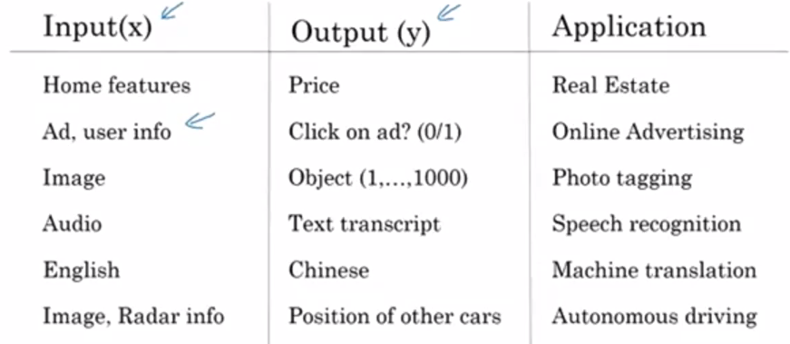

# Week 1: Introduction

## What is a neural network?

### Supervised Learning with Neural Networks

In supervised learning, you have some input \\(x\\) and some output \\(y\\) . The goal is to learn a mapping \\(x \rightarrow y\\) .

Possibly, the single most lucrative (but not the most inspiring) application of deep learning today is online advertising. Using information about the ad combined with information about the user as input, neural networks have gotten very good at predicting whether or not you click on an ad. Because the ability to show you ads that you're more likely to click on has a _direct impact on the bottom line of some of the very large online advertising companies_.

Here are some more areas in which deep learning has had a huge impact:

- __Computer vision__ the recognition and classification of objects in photos and videos.
- __Speech Recognition__ converting speech in audio files into transcribed text.
- __Machine translation__ translating one natural language to another.
- __Autonomous driving__

A lot of the value generation from using neural networks have come from intelligently choosing our \\(x\\) and \\(y\\) and learning a mapping.

We tend to use different architectures for different types of data. For example, __convolutional neural networks__ (CNNs) are very common for _image data_, while __recurrent neural networks__ (RNNs) are very common for _sequence data_ (such as text). Some data, such as radar data from autonomous vehicles, don't neatly fit into any particularly category and so we typical use a complex/hybrid network architecture.

### Structured vs. Unstructured Data

You can think of __structured data__ as essentially meaning _databases of data_. It is data that is highly _structured_, typically with multiple, well-defined attributes for each piece of data. For example, in housing price prediction, you might have a database where the columns tells you the size and the number of bedrooms. Or in predicting whether or not a user will click on an ad, you might have information about the user, such as the age, some information about the ad, and then labels why that you're trying to predict.

In contrast, __unstructured data__ refers to things like audio, raw audio,
or images. Here the features might be the pixel values in an image or the individual words in a piece of text. Historically, it has been much harder for computers to make sense of unstructured data compared to structured data. In contrast, the human race has evolved to be very good at understanding audio cues as well as images. _People are really good at interpreting unstructured data_. And so one of the most exciting things about the rise of neural networks is that, thanks to deep learning, thanks to neural networks, computers are now much better at interpreting unstructured data as compared to just a few years ago. This creates opportunities for many new exciting applications that use speech recognition, image recognition, and natural language processing on text.

Because people have a natural empathy to understanding unstructured data, you might hear about neural network successes on unstructured data more in the media because it's just cool when the neural network recognizes a cat. We all like that, and we all know what that means. But it turns out that a lot of short term economic value that neural networks are creating has also been on structured data, such as much better advertising systems, much better profit recommendations, and just a much better ability to process the giant databases that many companies have to make accurate predictions from them.

 

## Why is Deep Learning taking off?

_If the basic technical details surrounding deep learning have been around for decades, why are they just taking off now?_

First and foremost, the massive amount of (labeled) data we have been generating for the past couple of decades (in part because of the 'digitization' of our society).

It turns out, that large, complex neural networks can take advantage of these huge data stores. Thus, we often say _scale_ has been driving progress with deep learning, where scale means the size of the data, the size/complexity of the neural network, and the growth in computation.

The interplay between these 'scales' is apparent when you consider that many of the algorithmic advances of neural networks have come from making them more computational efficient.  

__Algorithmic Advances: ReLu__

One of the huge breakthroughs in neural networks has been the seemingly simple switch from the __sigmoid__ activation function to the __rectified linear__ (ReLu) activation function.

One of the problems with using __sigmoid__ functions is that its gradients approach 0 as input to the sigmoid function approaches and \\(+\infty\\) and \\(-\infty\\) . In this case, the updates to the parameters become very small and our learning slows dramatically.

With ReLu units, our gradient is equal to \\(1\\) for all positive inputs. This makes learning with gradient descent much faster. See [here](https://en.wikipedia.org/wiki/Rectifier_(neural_networks)) for more information on ReLu's.

__Scale Advances__

With smaller training sets, the relative ordering of the algorithms is actually not very well defined so if you don't have a lot of training data it is often up to your skill at hand engineering features that determines the
performance. For small training sets, it's quite possible that if someone training an SVM is more motivated to hand engineer features they will outperform a powerful neural network architecture.

 

However, for very large training sets, _we consistently see large neural networks dominating the other approaches_.
