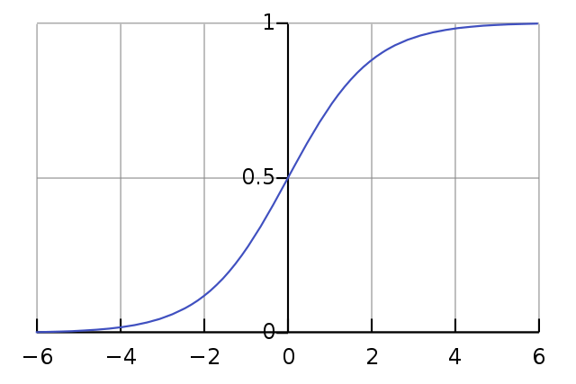
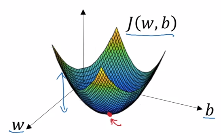
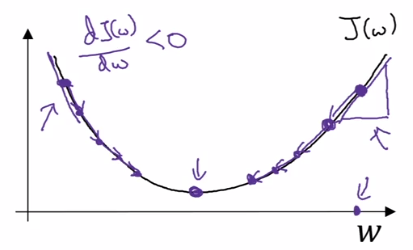
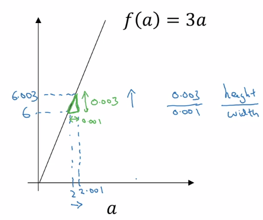
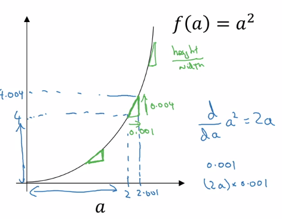
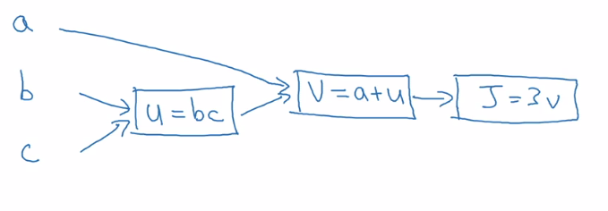
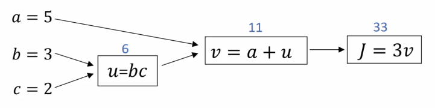
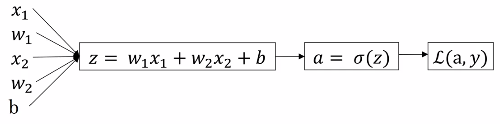
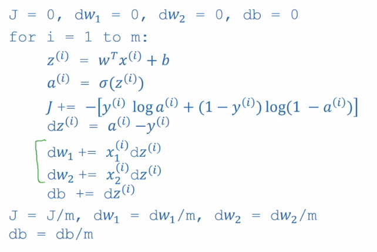
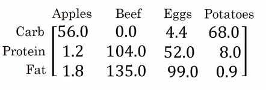

## Week 2: Neural networks basics

### Binary Classification

First, some notation,

- \\(n\\) is the number of data attributes, or _features_
- \\(m\\) is the number of input examples in our dataset (sometimes we write \\(m_{train}, m_{test}\\) to be more explicit).
- our data is represented as input, output pairs, \\((x^{(1)},y^{(1)}), ..., (x^{(m)},y^{(m)})\\) where \\(x \in \mathbb R^n\\) , \\(y \in \{0,1\}\\)
- \\(X\\) is our design matrix, which is simply columns of our input vectors \\(x^{(i)}\\) , thus it has dimensions of \\(n\\) x \\(m\\) .
- \\(Y = [y^{(1)}, ..., y^{(m)}]\\) , and is thus a \\(1\\) x \\(m\\) matrix.

> Note, this is different from many other courses which represent the design matrix, \\(X\\) as rows of transposed input vectors and the output vector \\(Y\\) as a \\(m\\) x \\(1\\) column vector. The above convention turns out to be easier to implement.

When programming neural networks, implementation details become extremely important (_e.g_. vectorization in place of for loops).

We are going to introduce many of the key concepts of neural networks using __logistic regression__, as this will make them easier to understand. Logistic regression is an algorithm for __binary classification__. In binary classification, we have an input (_e.g_. an image) that we want to classifying as belonging to one of two classes.

#### Logistic Regression (Crash course)

Given an input feature vector \\(x\\) (perhaps corresponding to an images flattened pixel data), we want \\(\hat y\\) , the probability of the input examples class, \\(\hat y = P(y=1 | x)\\)

> If \\(x\\) is a picture, we want the chance that this is a picture of a cat, \\(\hat y\\) .

The parameters of our model are \\(w \in \mathbb R^{n_x}\\) , \\(b \in \mathbb R\\) . Our output is \\(\hat y = \sigma(w^Tx + b)\\) were \\(\sigma\\) is the __sigmoid function__.



The formula for the sigmoid function is given by: \\(\sigma(z) = \frac{1}{1 + e^{-z}}\\) where \\(z = w^Tx + b\\) . We notice a few things:

- If \\(z\\) is very large, \\(e^{-z}\\) will be close to \\(0\\) , and so \\(\sigma(z)\\) is very close to \\(1\\) .
- If \\(z\\) is very small, \\(e^{-z}\\) will grow very large, and so \\(\sigma(z)\\) is very close to \\(0\\) .

> It helps to look at the plot \\(y = e^{-x}\\)

Thus, logistic regression attempts to learn parameters which will classify images based on their probability of belonging to one class or the other. The classification decision is decided by applying the sigmoid function to \\(w^Tx + b\\) .

> Note, with neural networks, it is easier to keep the weights \\(w\\) and the biases \\(b\\) separate. Another notation involves adding an extra parameters, \\(w_0\\), which plays the role of the bias.

__Loss function__

Our prediction for a given example \\(x^{(i)}\\) is \\(\hat y^{(i)} = \sigma(w^Tx^{(i)} + b)\\) .

We chose __loss function__, \\(\ell(\hat y, y) = -(y \; log\; \hat y + (1-y) \;log(1-\hat y))\\).

We note that:

- If \\(y=1\\) , then the loss function is \\(\ell(\hat y, y) = -log\; \hat y\\) . Thus, the loss approaches zero as \\(\hat y\\) approaches 1.
- If \\(y=0\\) , then the loss function is \\(\ell(\hat y, y) = -log\; (1 -\hat y)\\) . Thus, the loss approaches zero as \\(\hat y\\) approaches 0.

> Note, while \\(\ell_2\\) loss is taught in many courses and seems like an appropriate choice, it is non-convex and so we cannot use gradient descent to optimize it.

> An optional video is given further justifying the use of this loss function. Watch it and add notes here!

Note that the __loss function__ measures how well we are doing on a _single example_. We now define a __cost function__, which captures how well we are doing on the entire dataset:

\\(J(w,b) = \frac{1}{m}\sum^m_{i=1} \ell(\hat y^{(i)}, y^{(i)}) = - \frac{1}{m}\sum^m_{i=1}(y^{(i)} \; log\; \hat y^{(i)} + (1-y^{(i)}) \;log(1-\hat y^{(i)}))\\)

> Note that this notation is somewhat unique, typically the cost/loss functions are just interchangeable terms. However in this course, we will define the __loss function__ as computing the error for a single training example and the __cost function__ as the average of the loss functions of the entire training set.

#### Gradient Descent

We want to find \\(w,b\\) which minimize \\(J(w,b)\\) . We can plot the __cost function__ with \\(w\\) and \\(b\\) as our horizontal axes:



> In practice, \\(w\\) typically has many more dimensions.

Thus, the cost function \\(J(w,b)\\) can be thought of as a surface, were the height of the surface above the horizontal axes is its value. We want to find the values of our parameters \\(w, b\\) at the lowest point of this surface, the point at which the average loss is at its minimum.

__Gradient Descent Algorithm__

Initialize \\(w,b\\) to some random values

> because this cost function is convex, it doesn't matter what values we use to initialize, \\(0\\) is usually chosen for logistic regression.

Repeat

1. \\(w := w - \alpha \frac{dJ(w)}{dw}\\)
2. \\(b := b - \alpha \frac{dJ(w)}{db}\\)

> \\(\alpha\\) is our learning rate, it controls how big a step we take on each iteration. In some notations, we use \\(\partial\\) to denote the partial derivative of a function with \\(2\\) or more variables, and \\(d\\) to denote the derivative of a function of only \\(1\\) variable.



When implementing gradient descent in code, we will use the variable \\(dw\\) to represent \\(\frac{dJ(w, b)}{dw}\\) (this size of the step for \\(w\\) and \\(db\\) to represent \\(\frac{dJ(w, b)}{db}\\) (the size of the step for \\(b\\) .

#### (ASIDE) Calculus Review

__Intuition about derivatives__

###### Linear Function Example

Take the function \\(f(a) = 3a\\). Then \\(f(a) = 6\\) when \\(a = 2\\) . If we were to give \\(a\\) a tiny nudge, say to \\(a = 2.001\\) , what happens to \\(f(a)\\) ?



Then \\(f(a) = 6.003\\) , but more importantly if we inspect the triangle formed by performing the nudge, we can get the slope of the function between \\(a\\) and \\(a + 0.001\\) as the \\(\frac{height}{width} = 3\\) .

Thus, the __derivative__ (or slope) of \\(f(a)\\) _w.r.t_ \\(a\\) is \\(3\\) . We say that \\(\frac{df(a)}{da} = 3\\) or \\(\frac{d}{da}f(a) = 3\\)

> Add my calculus notes here!
> Link to BlueBrown videos.

###### Non-Linear Function Example

Take the function \\(f(a) = a^2\\) . Then \\(f(a) = 4\\) when \\(a = 2\\) . If we were to give \\(a\\) a tiny nudge, say to \\(a = 2.001\\), what happens to \\(f(a)\\)?



Then \\(f(a) = 4.004\\), but more importantly if we inspect the triangle formed by performing the nudge, we can get the slope of the function between \\(a\\) and \\(a + 0.001\\) as the \\(\frac{height}{width} = 4\\) .

In a similar way, we can perform this analysis for any point \\(a\\) on the plot, and we will see that slope of \\(f(a)\\) at some point \\(a\\) is equal to \\(2a\\) .

Thus, the __derivative__ (or slope) of \\(f(a)\\) _w.r.t_ \\(a\\) is \\(2a\\) . We say that \\(\frac{df(a)}{da} = 2a\\) or \\(\frac{d}{da}f(a) = 2a\\) .

#### Computation Graph

A __computation graph__ organizes a series of computations into left-to-right and right-to-left passes. Lets build the intuition behind a computation graph.

Say we are trying to compute a function \\(J(a,b,c) = 3(a + bc)\\) . This computation of this function actually has three discrete steps:

- compute \\(u = bc\\)
- compute \\(v = a + u\\)
- compute J = \\(3v\\)

We can draw this computation in a graph:



The computation graph is useful when you have some variable or output variable that you want to optimize (\\(J\\) in this case, in logistic regression it would be our _cost function output_). A _forward pass_ through the graph is represented by _left-to-right_ arrows (as drawn above) and a _backwards pass_ is represented by _right-to-left_ arrows.

A backwards pass is a natural way to represent the computation of our derivatives.  

__Derivatives with a computation graph__

Lets take a look at our computation graph, and see how we can use it to compute the partial derivatives of \\(J\\) i.e., lets carry out backpropogation on this computation graph by hand.

> Informally, you can think of this as asking: "If we were to change the value of \\(v\\) slightly, how would \\(J\\) change?"



First, we use our informal way of computing derivatives, and note that a small change to \\(v\\) results in a change to \\(J\\) of 3X that small change, and so \\(\frac{dJ}{dv} = 3\\) . This represents one step in our backward pass, the first step in backpropagation.

Now let's look at another example. What is \\(\frac{dJ}{da}\\)?

We compute the \\(\frac{dJ}{da}\\) from the second node in the computation graph by noting that a small change to \\(a\\) results in a change to \\(J\\) of 3X that small  change, and so \\(\frac{dJ}{da} = 3.\\) This represents our second step in our backpropagation.

One way to break this down is to say that by changing \\(a\\), we change \\(v\\), the magnitude of this change is \\(\frac{dv}{da}\\) . Through this change in \\(v\\), we also change \\(J\\), and the magnitude of the change is \\(\frac{dJ}{dv}\\) . To capture this more generally, we use the __chain rule__ from calculus, informally:

\\[\text{if } a \rightarrow v \rightarrow J \text{, then } \frac{dJ}{da} = \frac{dJ}{dv} \frac{dv}{da}\\]

> Here, just take \\(\rightarrow\\) to mean 'effects'. A formal definition of the chain rule can be found [here](https://en.wikipedia.org/wiki/Chain_rule).

The amount \\(J\\) changes when you when you nudge \\(a\\) is the product of the amount \\(J\\) changes when you nudge \\(v\\) multiplied by the amount \\(v\\) changes when you nudge \\(a\\) .

> __Implementation note__: When writing code to implement backpropagation, there is typically a single output variable you want to optimize, \\(dvar\\), (the value of the cost function). We will follow to notation of calling this variable \\(dvar\\) .

If we continue performing backpropagation steps, we can determine the individual contribution a change to the input variables has on the output variable. For example,

\\[\frac{dJ}{db} = \frac{dJ}{du} \frac{du}{db} = (3)(2) = 6\\]

The key take away from this video is that when computing derivatives to determine the contribution of input variables to change in an output variable, the most efficient way to do so is through a right to left pass through a computation graph. In particular, we'll first compute the derivative with respect to the output of the left-most node in a backward pass, which becomes useful for computing the derivative with respect to the next node and so forth. The __chain rule__ makes the computation of these derivatives tractable.

#### Logistic Regression Gradient Descent

Logistic regression recap:

\\[z = w^Tx + b\\]
\\[\hat y = a = \sigma(z)\\]
\\[\ell(a,y) = -(ylog(a) + (1-y)log(1-a))\\]

> \\(\ell\\) is our loss for a single example, and \\(\hat y\\) are our predictions.

For this example, lets assume we have only two features: \\(x_1\\), \\(x_2\\) . Our computation graph is thus:




Our goal is to modify the parameters to minimize the loss \\(\ell\\) . This translates to computing derivatives \\(w.r.t\\) the loss function. Following our generic example above, we can compute all the relevant derivatives using the chain rule. The first two passes are computed by the following derivatives:

1. \\(\frac{d\ell(a,y)}{da} = - \frac{y}{a} + \frac{1-y}{1-a}\\)
2. \\(\frac{d\ell(a,y)}{dz} = \frac{d\ell(a,y)}{da} \cdot \frac{da}{dz} =  a - y\\)

> Note: You should prove these to yourself.

> __Implementation note__, we use \\(dx\\) as a shorthand for \\(\frac{d\ell(\hat y,y)}{dx}\\) for some variable \\(x\\) when implementing this in code.


Recall that the final step is to determine the derivatives of the loss function \\(w.r.t\\) to the parameters.

- \\(\frac{d\ell(a,y)}{dw_1} = x_1 \cdot \frac{d\ell(a,y)}{dz}\\)
- \\(\frac{d\ell(a,y)}{dw_2} = x_2 \cdot \frac{d\ell(a,y)}{dz}\\)

One step of gradient descent would perform the updates:

- \\(w_1 := w_1 - \alpha \frac{d\ell(a,y)}{dw_1}\\)
- \\(w_2 := w_2 - \alpha \frac{d\ell(a,y)}{dw_2}\\)
- \\(b := b - \alpha \frac{d\ell(a,y)}{db}\\)

__Extending to \\(m\\) examples__

Lets first remind ourself of the logistic regression __cost__ function:

\\[J(w,b) = \frac{1}{m}\sum^m_{i=1} \ell(\hat y^{(i)}, y^{(i)}) = - \frac{1}{m}\sum^m_{i=1}(y^{(i)} \; log\; \hat y^{(i)} + (1-y^{(i)}) \;log(1-\hat y^{(i)}))\\]

Where,

\\[\hat y = a = \sigma(z) = \sigma(w^Tx^{(i)} + b)\\]

In the example above for a single training example, we showed that to perform a gradient step we first need to compute the derivatives \\(\frac{d\ell(a,y)}{dw_1}, \frac{d\ell(a,y)}{dw_2}, \frac{d\ell(a,y)}{db}\\) . For \\(m\\) examples, these are computed as follows:

- \\(\frac{\partial\ell(a,y)}{\partial dw_1} = \frac{1}{m}\sum^m_{i=1} \frac{\partial}{\partial w_1} \ell(\hat y^{(i)}, y^{(i)})\\)
- \\(\frac{\partial\ell(a,y)}{\partial w_2} = \frac{1}{m}\sum^m_{i=1} \frac{\partial}{\partial w_2} \ell(\hat y^{(i)}, y^{(i)})\\)
- \\(\frac{\partial\ell(a,y)}{\partial b} = \frac{1}{m}\sum^m_{i=1} \frac{\partial}{\partial b} \ell(\hat y^{(i)}, y^{(i)})\\)

We have already shown on the previous slide how to compute \\(\frac{\partial}{\partial w_1} \ell(\hat y^{(i)}, y^{(i)}), \frac{\partial}{\partial w_2} \ell(\hat y^{(i)}, y^{(i)})\\) and \\(\frac{\partial}{\partial b} \ell(\hat y^{(i)}, y^{(i)})\\) . Gradient descent for \\(m\\) examples essentially involves computing these derivatives for each input example \\(x^{(i)}\\) and averaging the result before performing the gradient step. Concretely, the pseudo-code for gradient descent on \\(m\\) examples of \\(n=2\\) features follows:

__ALGO__

Initialize \\(J=0; dw_1 = 0; dw_2 = 0; db = 0\\)

for \\(i=1\\) to \\(m\\):

- \\(z^{(i)} = w^Tx^{(i)}\\)
- \\(a^{(i)} = \sigma(z^{(i)})\\)
- \\(J \text{+= } -[y^{(i)}log(a^{(i)}) + (1-y^{(i)})log(1-a^{(i)})]\\)
- \\(dz^{(i)} = a^{(i)} - y^{(i)}\\)
- for \\(j = 1\\) to \\(n\\)
  - \\(dw_j \text{+= } x_j^{(i)}dz^{(i)}\\)
  - \\(dw_j \text{+= } x_j^{(i)}dz^{(i)}\\)
- \\(db \text{+= } dz^{(i)}\\)

\\(J \text{/= } m;\; dw_1 \text{/= } m;\; dw_2 \text{/= }  m;\;db \text{/= }  m\\)

In plain english, for each training example, we use the sigmoid function to compute its activation, accumulate a loss for that example based on the current parameters, compute the derivative of the current cost function \\(w.r.t\\) the activation function, and update our parameters and bias. Finally we take the average of our cost function and our gradients.

Finally, we use our derivatives to update our parameters,

- \\(w_1 := w_1 - \alpha \cdot {dw_1}\\)
- \\(w_2 := w_2 - \alpha \cdot {dw_2}\\)
- \\(b := b - \alpha \cdot {db}\\)

This constitutes __one step__ of gradient descent.

The main problem with this implementation is the nested for loops. For deep learning, which requires very large training sets, _explicit for loops_ will make our implementation very slow. Vectorizing this algorithm will greatly speed up our algorithms running time.

#### Vectorization

Vectorization is basically the art of getting rid of explicit for loops. In practice, deep learning requires large datasets (at least to obtain high performance). Explicit for loops lead to computational overhead that significantly slows down the training process.

The main reason vectorization makes such a dramatic difference is that it allows us to take advantage of __parallelization__. The rule of thumb to remember is: _whenever possible, avoid explicit for-loops_.

> In a toy example were \\(n_x\\) is \\(10^6\\), and \\(w, x^{(i)}\\) are random values, vectorization leads to an approximately 300X speed up to compute all \\(z^{(i)}\\)

Lets take a look at some explicit examples:

- Multiply a __matrix__ by a __vector__, e.g., \\(u = Av\\) .

  So, \\(u_i = \sum_jA_{ij}v_j\\) . Instead of using for nested loops, use: `u = np.dot(A,v)`

- Apply exponential operation on every element of a matrix/vector \\(v\\).

  Again, use libraries such as `numpy` to perform this with a single operation, e.g., `u = np.exp(v)`

  > This example applies to almost all operations, `np.log(v)`, `np.abs(v)`, `np.max(v)`, etc...

__Example: Vectorization of Logistic Regression__

###### Forward pass

Lets first review the forward pass of logistic regression for \\(m\\) examples:

\\(z^{(1)} = w^Tx^{(1)} + b\\);  \\(a^{(1)} = \sigma(z^{1})\\), \\(...\\) , \\(z^{(m)} = w^Tx^{(m)} + b\\);  \\(a^{(m)} = \sigma(z^{m})\\)

In logistic regression, we need to compute \\(z^{(i)} = w^Tx^{(i)}+b\\) for each input example \\(x^{(i)}\\) . Instead of using a for loop over each \\(i\\) in range \\((m)\\) we can use a vectorized implementation to compute z directly.

Our vectors are of the dimensions: \\(w \in \mathbb R^{n_x}\\), \\(b \in \mathbb R^{n_x}\\), \\(x \in \mathbb R^{n_x}\\).

Our parameter vector, bias vector, and design matrix are,

\\(w = \begin{bmatrix}w_1 \\\\ ... \\\\ w_{n_x}\end{bmatrix}\\), \\(b = \begin{bmatrix}b_1 \\\\ ... \\\\ b_{n_x}\end{bmatrix}\\), \\(X = \begin{bmatrix}x_1^{(1)} & ... & x_1^{(m)} \\\\ ... \\\\ x^{(1)}_{n_x}\end{bmatrix}\\)

So, \\(w^T \cdot X + b = w^Tx^{(i)} + b\\) (for all \\(i\\)). Thus we can compute all \\(w^Tx^{(i)}\\) in one operation if we vectorize!

In numpy code:

`Z = np.dot(w.T, X) + b`

> Note, \\(+ b\\) will perform element-wise addition in python, and is an example of __broadcasting__.

Where \\(Z\\) is a row vector \\([z^{(1)}, ..., z^{(m)}]\\) .

###### Backward pass

Recall, for the gradient computation, we computed the following derivatives:

\\(dz^{(1)} = a^{(1)} - y^{(1)} ... dz^{(m)} = a^{(m)} - y^{(m)}\\)

We define a row vector,

\\(dZ = [dz^{(1)}, ..., dz^{(m)}]\\) .

From which it is trivial to see that,

\\(dZ = A - Y\\), where \\(A = [a^{(1)}, ..., a^{(m)}]\\) and \\(Y = [y^{(1)}, ..., y^{(m)}]\\) .

> This is an element-wise subtraction, \\(a^{(1)} - y^{(1)}, ..., a^{(m)} - y^{(m)}\\) that produces a \\(m\\) length row vector.

We can then compute our _average_ derivatives of the cost function \\(w.r.t\\) to the parameters in two lines of codes,

`db = 1/m * np.sum(dZ)`

`dw = 1/m * np.dot(X, dZ.T)`

Finally, we compare our non-vectorized approach to linear regression vs our vectorized approaches

Non-vectorized Approach       | Vectorized Approach 	|
|:-------------------------:|:-------------------------:|
|| |
|Two for loops, one over the training examples \\(x^{(i)}\\) and a second over the features \\(x^{(i)}_j\\) . We have omitted the outermost loop that iterates over gradient steps. | Note that, we still need a single for loop to iterate over each gradient step (regardless if we are using stochastic or mini-batch gradient descent) even in our vectorized approach. |

#### Broadcasting

Lets motivate the usefulness of __broadcasting__ with an example. Lets say you wanted to get the percent of total calories from carbs, proteins, and fats for multiple foods.



_Can we do this without an explicit for loop?_

Set this matrix to a `(3,4)` numpy matrix `A`.

```
import numy as np

# some numpy array of shape (3,4)
A = np.array([
  [...],
  [...],
  [...]
  ])

cal = A.sum(axis=0) # get column-wise sums
percentage = 100 * A / cal.reshape(1,4) # get percentage of total calories
```

So, we took a `(3,4)` matrix `A` and divided it by a `(1,4)` matrix `cal`. This is an example of broadcasting.

The general principle of broadcast can be summed up as follows:

- \\((m,n) \text{ [+ OR - OR * OR /] } (1, n) \Rightarrow (m,n) \text{ [+ OR - OR * OR /] } (m \text{ copies}, n)\\)
- \\((m,n) \text{ [+ OR - OR * OR /] } (m, 1) \Rightarrow (m,n) \text{ [+ OR - OR * OR /] } (m, n \text{ copies})\\)

Where \\((m, n), (1, n)\\) are matrices, and the operations are performed _element-wise_ after broadcasting.


__More broadcasting examples__

###### Addition

_Example 1_: \\(\begin{bmatrix}1 \\\\ 2 \\\\ 3 \\\\ 4\end{bmatrix} + 100 == \begin{bmatrix}1 \\\\ 2 \\\\ 3 \\\\ 4\end{bmatrix} + \begin{bmatrix}100 \\\\ 100 \\\\ 100 \\\\ 100\end{bmatrix} = \begin{bmatrix}101 \\\\ 102 \\\\ 103 \\\\ 104\end{bmatrix}\\)

_Example 2_: \\(\begin{bmatrix}1 & 2 & 3 \\\\ 4 & 5 & 6\end{bmatrix} + \begin{bmatrix}100 & 200 & 300\end{bmatrix} == \begin{bmatrix}1 & 2 & 3 \\\\ 4 & 5 & 6\end{bmatrix} + \begin{bmatrix}100 & 200 & 300 \\\\ 100 & 200 & 300\end{bmatrix} = \begin{bmatrix}101 & 202 & 303 \\\\ 104 & 205 & 306\end{bmatrix}\\)

_Example 3_: \\(\begin{bmatrix}1 & 2 & 3  \\\\ 4 & 5 & 6\end{bmatrix} + \begin{bmatrix}100 \\\\ 200\end{bmatrix} == \begin{bmatrix}1 & 2 & 3 \\\\ 4 & 5 & 6\end{bmatrix} + \begin{bmatrix}100 & 100 & 100 \\\\ 200 & 200 & 200\end{bmatrix} = \begin{bmatrix}101 & 202 & 303 \\\\ 104 & 205 & 206\end{bmatrix}\\)

#### (AISDE) A note on python/numpy vectors

The great flexibility of the python language paired with the numpy library is both a strength and a weakness. It is a strength because of the great expressivity of the pair, but with this comes the opportunity to intro strange, hard-to-catch bugs if you aren't familiar with the intricacies of numpy and in particular broadcasting.

Here are a couple of tips and tricks to minimize the number of these bugs:

- Creating a random array: `a = np.random.randn(5)`
- Arrays of shape `(x, )` are known as __rank 1 array__. They have some nonintuitive properties and don't consistently behave like either a column vector or a row vector. Let `b` be a rank 1 array.
  - `b.T == b`
  - `np.dot(b, b.T)` is a real number, _not the outer product as you might expect_.
- Thus, in this class at least, using rank 1 tensors with an unspecified dimension length is not generally advised. _Always specify both dimensions_.
- If you know the size that your numpy arrays should be in advance, its often useful to throw in a python assertion to help catch strange bugs before they happen:
  - `assert(a.shape == (5,1))`
- Additionally, the reshape function runs in linear time and is thus very cheap to call, use it freely!
   - `a = a.reshape((5,1))`
