## Week 3: Shallow neural networks

### Neural network overview

Up until this point, we have used logistic regression as a stand-in for neural networks. The "network" we have been describing looked like:

Network       | Computation Graph 	|
|:-------------------------:|:-------------------------:|
|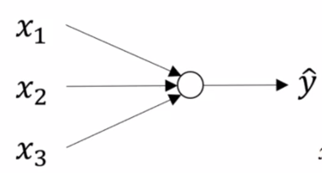|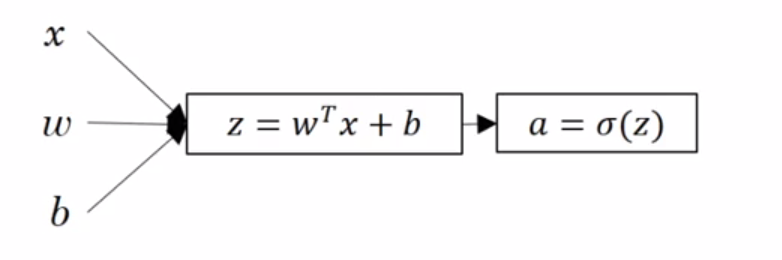|

> \\(a\\) and  \\(\hat y\\) are used interchangeably

A neural network looks something like this:

Network       | Computation Graph 	|
|:-------------------------:|:-------------------------:|
|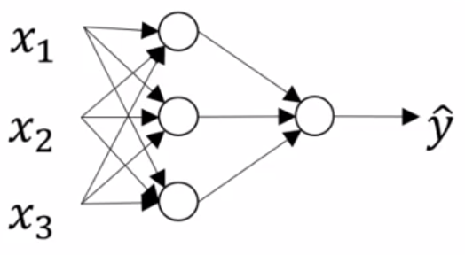|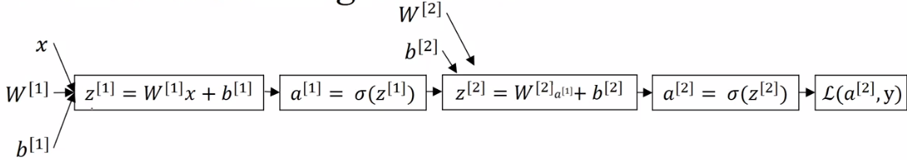|

> We typically don't distinguish between \\(z\\) and \\(a\\) when talking about neural networks, one neuron = one activation = one \\(a\\) like calculation.

We will introduce the notation of superscripting values with \\(^{[l]}\\), where \\(l\\) refers to the layer of the neural network that we are talking about.

> Not to be confused with \\(^{(i)}\\) which we use to refer to a single input example \\(i\\) .

_The key intuition is that neural networks stack activations of inputs multiplied by their weights_.

Similar to the 'backwards' step that we discussed for logistic regression, we will explore the backwards steps that makes learning in a neural network possible.

#### Neural network Representation

This is the canonical representation of a neural network

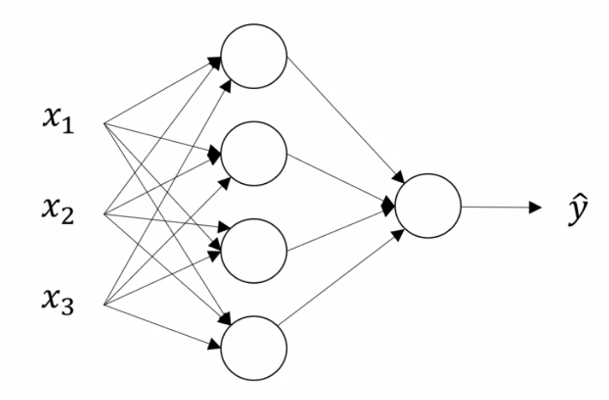

On the left, we have the __input features__ stacked vertically. This constitutes our __input layer__. The final layer, is called the __output layer__ and it is responsible for generating the predicted value \\(\hat y\\) . Any layer in between these two layers is known as a __hidden layer__. This name derives from the fact that the _true values_ of these hidden units is not observed in the training set.

> The hidden layers and output layers have parameters associated with them. These parameters are denoted \\(W^{[l]}\\) and \\(b^{[l]}\\) for layer \\(l\\) .

Previously, we were referring to our input examples as \\(x^{(i)}\\) and organizing them in a design matrix \\(X\\) . With neural networks, we will introduce the convention of denoting output values of a layer \\(l\\), as a column vector \\(a^{[l]}\\), where \\(a\\) stands for _activation_. You can also think of these as the values a layer \\(l\\) passes on to the next layer.

Another note: the network shown above is a _2-layer_ neural network. We typically do not count the input layer. In light of this, we usually denote the input layer as \\(l=0\\).

#### Computing a Neural Networks Output

We will use the example of a single hidden layer neural network to demonstrate the forward propagation of inputs through the network leading to the networks output.

We can think of each unit in the neural network as performing two steps, the _multiplication of inputs by weights and the addition of a bias_, and the _activation of the resulting value_

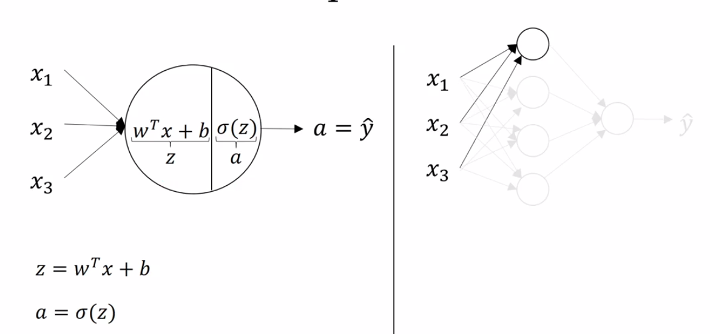

> Recall, that we will use a superscript, \\(^{[l]}\\) to denote values belonging to the \\(l-th\\) layer.

So, the \\(j^{th}\\) node of the \\(l^{th}\\) layer performs the computation

\\[ a_j^{[l]} = \sigma(w_j^{[l]^T}a^{[l-1]} + b_j^{[l]}) \\]

> Where \\(a^{[l-1]}\\) is the activation values from the precious layer.

for some input \\(x\\). With this notation, we can draw our neural network as follows:

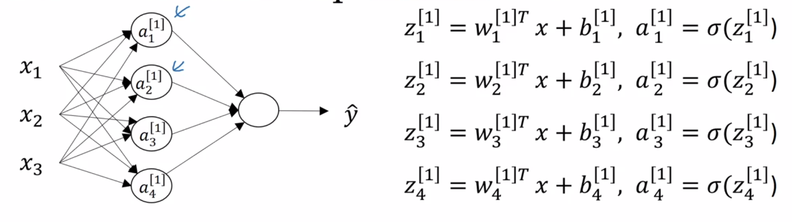

In order to easily vectorize the computations we need to perform, we designate a matrix \\(W^{[l]}\\) for each layer \\(l\\), which has dimensions _(number of units in current layer X number of units in previous layer)_

We can vectorize the computation of \\(z^{[l]}\\) as follows:

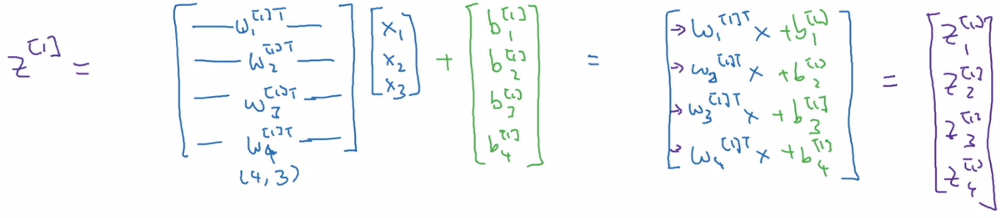

And the computation of \\(a^{[l]}\\) just becomes the element-wise application of the sigmoid function:

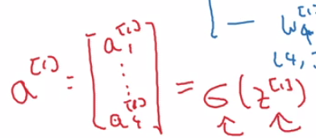

We can put it all together for our two layer neural network, and outline all the computations using our new notation:

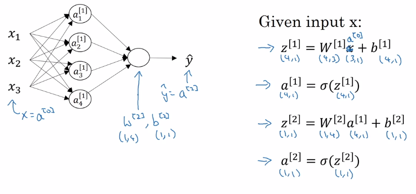

#### Vectorizing across multiple examples

In the last video, we saw how to compute the prediction for a neural network with a single input example. In this video, we introduce a vectorized approach to compute predictions for many input examples.  

We have seen how to take a single input example \\(x\\) and compute \\(a^{[2]} = \hat y\\) for a 2-layered neural network. If we have \\(m\\) training examples, we can used a vectorized approach to compute all \\(m\\) predictions.

First, lets introduce a new notation. The activation values of layer \\(l\\) for input example \\(i\\) is:

\\[ a^{[l] (i)} \\]

The \\(m\\) predictions our 2-layered are therefore computed in the following way:

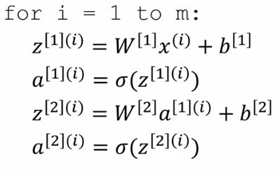

Recall that \\(X\\) is a \\((n_x, m)\\) design matrix, where each column is a single input example and \\(W^{[l]}\\) is a matrix where each row is the transpose of the parameter column vector for layer \\(l\\).

Thus, we can now compute the activation of a layer in the neural network for all training examples:

\\[Z^{[l]} = W^{[l]}X + b^{[l]}\\]
\\[A^{[l]} = sign(Z^{[l]})\\]

As an example, the result of a matrix multiplication of \\(W^{[1]}\\) by \\(X\\) is a matrix with dimensions \\((j, m)\\) where \\(j\\) is the number of units in layer \\(1\\) and \\(m\\) is the number of input examples

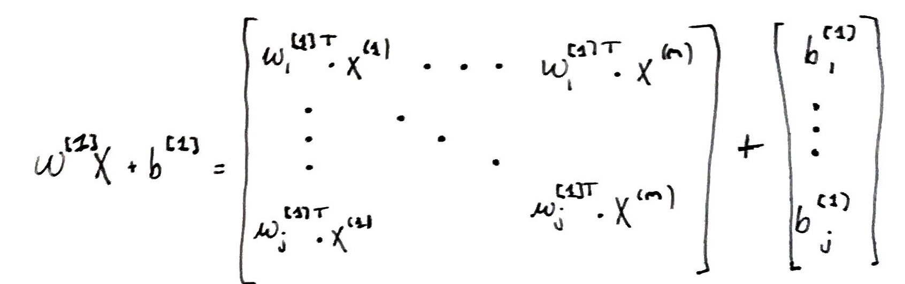

\\(A^{[l]}\\) is therefore a matrix of dimensions (size of layer \\(l\\) X \\(m\\)). The top-leftmost value is the activation for the first unit in the layer \\(l\\) for the first input example \\(i\\), and the bottom-rightmost value is the activation for the last unit in the layer \\(l\\) for the last input example \\(m\\) .

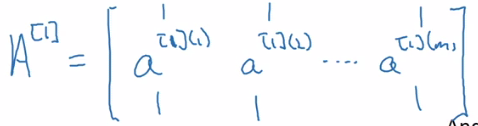

### Activation Functions

So far, we have been using the __sigmoid__ activation function

\\[\sigma(z) = \frac{1}{1 + e^{-z}}\\]

It turns out there are much better options.

#### Tanh

The __hyperbolic tangent function__ is a non-linear activation function that almost always works better than the sigmoid function.

\\[tanh(z) = \frac{e^z - e^{-z}}{e^z + e^{-z}}\\]

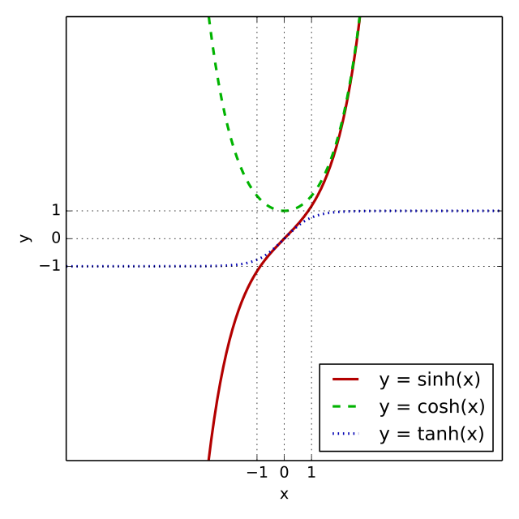

> The tanh function is really just a shift of the sigmoid function so that it crosses through the origin.

The tanh activation usually works better than sigmoid activation function for hidden units because the mean of its output is closer to zero, and so it centers the data better for the next layer.

The single exception of sigmoid outperforming tanh is when its used in the ouput layer. In this case, it can be more desirable to scale our outputs from \\(0\\) to \\(1\\) (particularly in classification, when we want to output the probability that something belongs to a certain class). Indeed, we often mix activation functions in neural networks, and denote them:

\\[g^{[p]}(z)\\]

Where \\(p\\) is the \\(p^{th}\\) activation function.

If \\(z\\) is either very large, or very small, the derivative of both the tanh and sigmoid functions becomes very small, and this can slow down learning.

#### ReLu

The __rectified linear unit__ activation function solves the disappearing gradient problem faced by tanh and sigmoid activation functions. In practice, it also leads to faster learning.

\\[ReLu(z) = max(0, z)\\]

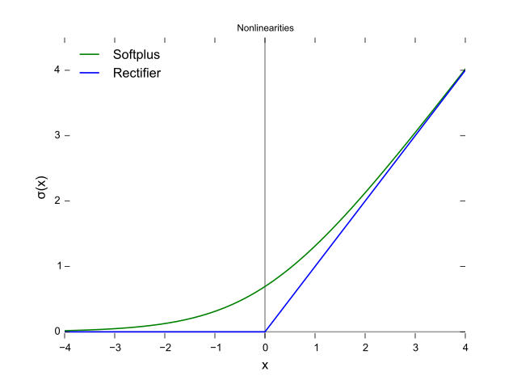

> Note: the derivative at exactly 0 is not well-defined. In practice, we can simply set it to 0 or 1 (it matters little, due to the unlikeliness of a floating point number to ever be \\(0.0000...\\) exactly).

One disadvantage of ReLu is that the derivative is equal to \\(0\\) when \\(z\\) is negative. __Leaky ReLu__'s aim to solve this problem with a slight negative slope for values of \\(z<0\\) .

\\[ReLu(z) = max(0.01 * z, z)\\]

> Image sourced from [here](http://lamda.nju.edu.cn/weixs/project/CNNTricks/imgs/leaky.png).

Sometimes, the \\(0.01\\) value is treated as an adaptive parameter of the learning algorithm. Leaky ReLu's solve a more general problem of "[dead neurons](https://www.quora.com/What-is-the-definition-of-a-dead-neuron-in-Artificial-Neural-Networks?share=1)". However, it is not used as much in practice.

__Rules of thumb for choosing activations functions__

- _If your output is a 0/1 value_, i.e., you are performing binary classification, the sigmoid activation is a natural choice for the output layer.
- _For all other units_, ReLu's is increasingly the default choice of activation function.

__Why do you need non-linear activation functions?__

We could imagine using some __linear__ activation function, \\(g(z) = z\\) in place of the __non-linear__ activation functions we have been using so far. Why is this a bad idea? Lets illustrate out explanation using our simple neural networks

For this linear activation function, the activations of our simple network become:

\\[z^{[1]} = W^{[1]}x + b^{[1]}\\]
\\[a^{[1]} = z^{[1]}\\]
\\[z^{[2]} = W^{[2]}x + b^{[2]}\\]
\\[a^{[2]} = z^{[2]}\\]

From which we can show that,

\\[a^{[2]} = (W^{[2]}W^{[1]})x + (W^{[2]}b^{[1]} + b^{[2]})\\]
\\[a^{[2]} = W'x + b' \text{, where } W' = W^{[2]}W^{[1]} \text{ and } b' = W^{[2]}b^{[1]} + b^{[2]}\\]

Therefore, in the case of a _linear activation function_, the neural network is outputting a _linear function of the inputs_, no matter how many hidden layers!

###### Exceptions

There are (maybe) two cases in which you may actually want to use a linear activation function.

1. The output layer of a network used to perform regression, where we want \\(\hat y\\) to be a real-valued number, \\(\hat y \in \mathbb R\\)
2. Extremely specific cases pertaining to compression.

#### Derivatives of activation functions

When performing back-propogation on a network, we need to compute the derivatives of the activation functions. Lets take a look at our activation functions and their derivatives

__Sigmoid__

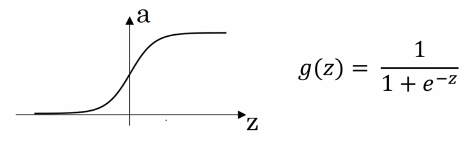

The deriviative of \\(g(z)\\), \\(g(z)'\\) is:

\\[\frac{d}{dz}g(z) = \frac{1}{1 + e^{-z}}(1 - \frac{1}{1 + e^{-z}})= g(z)(1-g(z)) = a(1-a)\\]

> We can sanity check this by inputting very large, or very small values of \\(z\\) into our derivative formula and inspecting the size of the outputs.

Notice that if we have already computed the value of \\(a\\), we can very cheaply compute the value of \\(g(z)'\\) .

__Tanh__

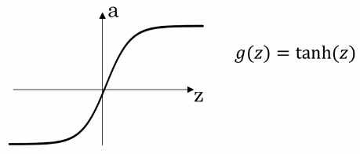

The deriviative of \\(g(z)\\), \\(g(z)'\\) is:

\\[\frac{d}{dz}g(z) = 1 - (tanh(z))^z\\]

> Again, we can sanity check this inspecting that the outputs for different values of \\(z\\) match our intuition about the activation function.

__ReLu__

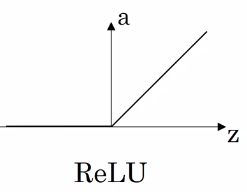

The derivative of \\(g(z)\\), \\(g(z)'\\) is:

\\[\frac{d}{dz}g(z) = 0 \text{ if } z < 0 ; 1 \text{ if } z > 0; \text{ undefined if } z = 0\\]

> If \\(z = 0\\), we typically default to setting \\(g(z)\\) to either \\(0\\) or \\(1\\) . In practice this matters little.

### Gradient descent for Neural Networks

Lets implement gradient descent for our simple 2-layer neural network.

Recall, our parameters are: \\(W^{[1]}, b^{[1]}, W^{[2]}, b^{[2]}\\) . We have number of features, \\(n_x = n^{[0]}\\), number of hidden units \\(n^{[1]}\\), and \\(n^{[2]}\\) output units.

Thus our dimensions:

- \\(W^{[1]}\\) : (\\(n^{[1]}, n^{[0]}\\))
- \\(b^{[1]}\\) : (\\(n^{[1]}, 1\\))
- \\(W^{[2]}\\) : (\\(n^{[2]}, n^{[1]}\\))
- \\(b^{[2]}\\) : (\\(n^{[2]}, 1\\))

Our cost function is: \\(J(W^{[1]}, b^{[1]}, W^{[2]}, b^{[2]}) = \frac{1}{m}\sum_{i=1}^m \ell(\hat y, y)\\)

> We are assuming binary classification.

__Gradient Descent sketch__

1. Initialize parameters _randomly_
2. Repeat:
    - compute predictions \\(\hat y^{(i)}\\) for \\(i = 1 ,..., m\\)
    - \\(dW^{[1]} = \frac{\partial J}{\partial W^{[1]}}, db^{[1]} = \frac{\partial J}{\partial b^{[1]}}, ...\\)
    - \\(W^{[1]} = W^{[1]} - \alpha dW^{[1]}, ...\\)
    - \\(b^{[1]} = b^{[1]} - \alpha db^{[1]}, ...\\)

The key to gradient descent is to computation of the derivatives, \\(\frac{\partial J}{\partial W^{[l]}}\\) and \\(\frac{\partial J}{\partial b^{[l]}}\\) for all layers \\(l\\) .

#### Formulas for computing derivatives

We are going to simply present the formulas you need, and defer their explanation to the next video. Recall the computation graph for our 2-layered neural network:

And the vectorized implementation of our computations in our __forward propagation__

1.\\[Z^{[1]} = W^{[1]}X + b^{[1]}\\]
2.\\[A^{[1]} = g^{[1]}(Z^{[1]})\\]
3.\\[Z^{[2]} = W^{[2]}A^{[1]} + b^{[2]}\\]
4.\\[A^{[2]} = g^{[2]}(Z^{[2]}) = \sigma(Z^{[2]})\\]

> Where \\(g^{[2]}\\) would likely be the sigmoid function if we are doing binary classification.

Now we list the computations for our __backward propagation__

1.\\[ dZ^{[2]} = A^{[2]} - Y \\]
2.\\[ dW^{[2]} = \frac{1}{m}dZ^{[2]}A^{[1]T} \\]

> Transpose of A accounts for the fact that W is composed of transposed column vectors of parameters.

3.\\[db^{[2]} = \frac{1}{m}np.sum(dZ^{[2]}, axis = 1, keepdims=True)\\]

> Where \\(Y = [y^{(1)}, ..., y^{[m]}]\\) . The `keepdims` arguments prevents numpy from returning a rank 1 array, \\((n,)\\)

4.\\[dZ^{[1]} = W^{[2]T}dZ^{[2]} \odot g(Z)' (Z^{[1]})\\]

> Where \\(\odot\\) is the element-wise product. Note: this is a collapse of \\(dZ\\) and \\(dA\\) computations.

5.\\[dW{[1]} = \frac{1}{m} = dZ^{[1]}X^T\\]
6.\\[db^{[1]} = \frac{1}{m}np.sum(dZ^{[1]}, axis=1, keepdims=True)\\]

### Random Initialization

When you train your neural network, it is important to initialize your parameters _randomly_. With logistic regression, we were able to initialize our weights to _zero_ because the cost function was convex. We will see that this _will not work_ with neural networks.

Lets take the following network as example:

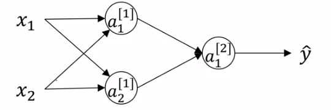

Lets say we initialize our parameters as follows:

\\(W^{[1]} = \begin{bmatrix}0 & 0 \\\\ 0 & 0 \end{bmatrix}\\), \\(b^{[1]} = \begin{bmatrix} 0 \\\\ 0 \end{bmatrix}\\),
\\(W^{[2]} = \begin{bmatrix} 0 & 0 \\\\ 0 & 0 \end{bmatrix}\\),
\\(b^{[2]} = \begin{bmatrix} 0 \\\\ 0 \end{bmatrix}\\)

> It turns out that initializing the bias \\(b\\) with zeros is OK.

The problem with this initialization is that for any input examples \\(i, j\\),

\\[a^{[1]}_i == a^{[1]}_j\\]

Similarly,

\\[dz^{[1]}_i == dz^{[1]}_j\\]

Thus, \\(dW^{[1]}\\) will be some matrix \\(\begin{bmatrix}u & v \\\\ u & v\end{bmatrix}\\) and all updates to the parameters \\(W^{[1]}\\) will be identical.

> Note we are referring to our single hidden layer \\(^{[1]}\\) but this would apply to any hidden layer of any fully-connected network, no matter how large.

Using a _proof by induction_, it is actually possible to prove that after any number of rounds of training the two hidden units are still computing _identical functions_. This is often called the __symmetry breaking problem__.

The solution to this problem, is to initialize parameters _randomly_. Heres an example on how to do that with numpy:

- \\(W^{[1]}\\) = `np.random.rand(2,2) * 0.01`
- \\(W^{[2]}\\) = `np.random.rand(1,2) * 0.01`
- ...

> This will generate small, gaussian random values.

- \\(b^{[1]}\\) = `np.zeros((2,1))`
- \\(b^{[2]}\\) = `0`
- ...

> In next weeks material, we will talk about how and when you might choose a different factor than \\(0.01\\) for initialization.

It turns out the \\(b\\) does not have this symmetry breaking problem, because as long as the hidden units are computing different functions, the network will converge on different values of \\(b\\), and so it is fine to initialize it to zeros.

__Why do we initialize to small values?__

For a _sigmoid-like_ activation function, large parameter weights (positive or negative) will make it more likely that \\(z\\) is very large (positive or negative) and thus \\(dz\\) will approach \\(0\\), _slowing down learning dramatically_.

> Note this is a less of an issue when using ReLu's, however many classification problems use sigmoid activations in their output layer.
