# Week 1: Recurrent Neural Networks

Recurrent neural networks have been proven to perform extremely well on temporal data. This model has several variants including [LSTMs](https://en.wikipedia.org/wiki/Long_short-term_memory), [GRUs](https://en.wikipedia.org/wiki/Gated_recurrent_unit) and Bidirectional [RNNs](https://en.wikipedia.org/wiki/Bidirectional_recurrent_neural_networks), which you are going to learn about in this section.

## Why sequence models?

Recurrent neural networks (RNNs) have proven to be incredibly powerful networks for sequence modelling tasks (where the inputs $x$, outputs $y$ or both are sequences) including:

- speech recognition
- music generation
- sentiment classification
- DNA sequence analysis
- machine translation
- video activity recognition
- named entity recognition

### Notation

As a motivating example, we will "build" a model that performs **named entity recognition** (**NER**).

_Example input_:

$$x: \text{Harry Potter and Hermione Granger invented a new spell.} $$

We want our model to output a target vector with the same number elements as our input sequence $x$, representing the **named entities** in $x$.

We will refer to each element in our input ($x)$ and output ($y$) sequences with angled brackets, so for example, $x^{<1>}$ would refer to "Harry". Because we have multiple input sequences, we denote the $i-th$ sequence $x^{(i)}$ (and its corresponding output sequence $y^{(i)}$). The $t-th$ element of the $i-th$ input sequence is therefore $x^{(i)<t>}$.

Let $T_x$ be the length of the input sequence and $T_y$ the length of the output sequence.

!!! note
    In our example, $T_x$ == $T_y$

### Representing words

For NLP applications, we have to decide on some way to represent words. Typically, we start by generating a __vocabulary__ (a dictionary of all the words that appear in our corpus).

!!! note
    In modern applications, a vocabulary of 30-50K is common and massive vocabularies (>1 million word types) are often used in commercial applications, especially by big tech.

A common way to represent each word is to use a __one-hot__ encoding. In this way, we represent each token by a vector of dimension $||V||$ (our vocabulary size).

_Example_:

$$x^{<1>} = \begin{pmatrix} 0 \\\ ..\\\ 1 \\ ... \\\ 0 \end{pmatrix}$$

$x^{<1>}$ of our sequence (i.e. the token _Harry_) is represented as a vector which contains all zeros except for a single value of one at row $j$, where $j$ is its position in $V$.

!!! note
    "One-hot" refers to the fact that each vector contains only a single 1.

The goal is to learn a mapping from each $x^{<t>}$ to some __tag__ (i.e. PERSON).

!!! note
    To deal with out-of-vocabulary (OOV) tokens, we typically assign a special value _<UNK\>_ and a corresponding vector.

## Recurrent Neural Network Model

### Why not a standard network?

In our previous example, we had 9 input words. You could imagine taking these 9 input words (represented as one-hot encoded vectors) as inputs to a "standard" neural network

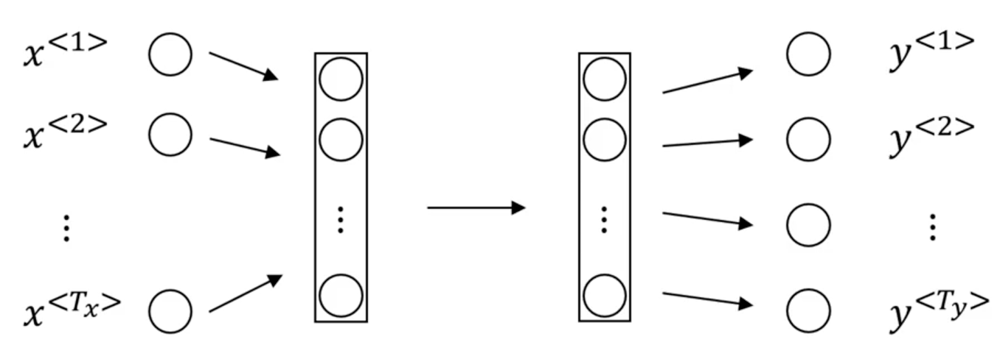

This turns out _not_ to work well. There are two main problems:

1. Inputs and outputs can be different __lengths__ in different examples (its not as if every $T_x, T_y$ pair is of the same length).
2. A "standard" network doesn't **share features** learned across different positions of text. This is a problem for multiple reasons, but a big one is that this network architecture doesn't capture dependencies between elements in the sequence (e.g., the information that is a word in its context is not captured).

### Recurrent Neural Networks

Unlike a "standard" neural network, **recurrent neural networks** (**RNN**) accept input from the _previous_ timestep in a sequence. For our example $x$ above, the _unrolled_ RNN diagram might look like the following:

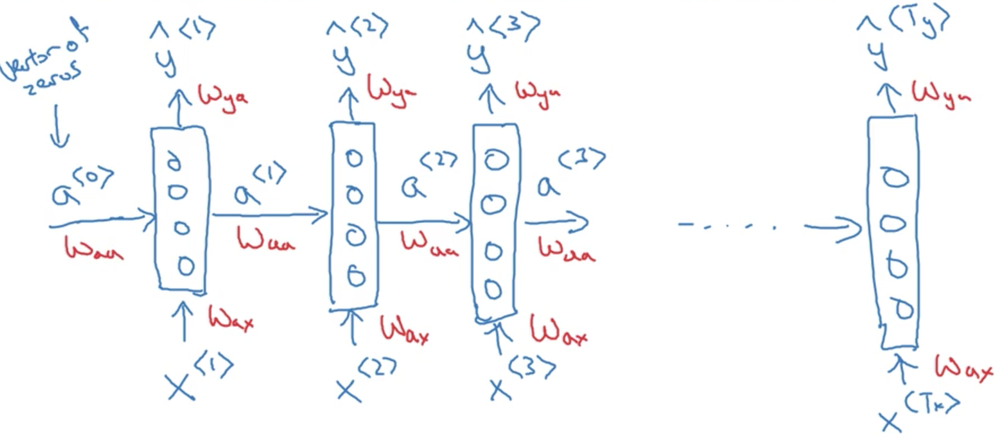

!!! note
    Timestep 0 is usually initialized with a fake vector of 0's

Note that the diagram is sometimes drawn like this:

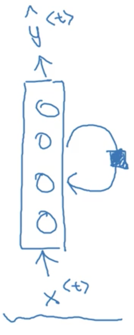

Where the little black box represented a delay of _1 timestep_.

A RNN learns on a sequence from _left to right_, **sharing** the parameters from **each timestep**.

- the parameters governing the connection from $x^{<t>}$ to the hidden layer will be some set of parameters we're going to write as $W_{ax}$.
- the activations, the horizontal connections, will be governed by some set of parameters $W_{aa}$
-  $W_{ya}$, governs the output predictions

!!! note
    We take the notation $W_{ya}$, to mean (for example) that the parameters for variable $y$ are obtained by multiplying by some quantity $a$.

Notice this parameter sharing means that when we make the prediction for, $y^{<3>}$ say, the RNN gets the information not only from $x^{<3>}$ but also from the all the previous timesteps.

Note a potential weakness here. We don't incorporate information from future timesteps in our predictions. This problem is solved by using **bidirectional** RNNs (BRNNs) which we discuss in a future video.

_Example_:

Given the sentences:

$x^{(1)}$: _He said, "Teddy Roosevelt was a great President"_

$x^{(2)}$: _He said, "Teddy bears are on sale!"_

And the task of __named entity recognition__ (__NER__), it would be really useful to know that the word "_President_" follows the name "_Teddy Roosevelt_" because as the second example suggest, using only _previous_ information in the sequence might not be enough to make a classification decision about an entity.

#### RNN Computation

Lets dig deeper into how a RNN works. First, lets start with a cleaned up depiction of our network

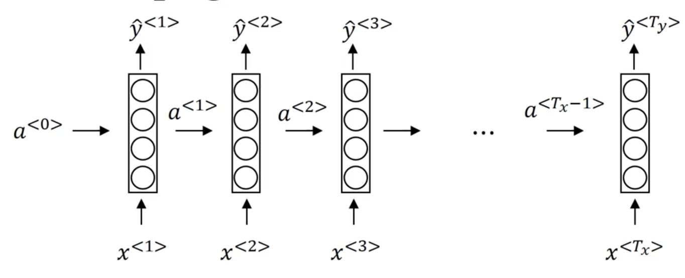

##### Forward Propagation

Typically, we start off with the input $a^{<0>} = \vec 0$. Then we perform our forward pass

- Compute our **activation** for timestep 1: $a^{<1>} = g(W_{aa}a^{<0>} + W_{ax}x^{<1>} + b_a)$
- Compute our **prediction** for timestep 1: $\hat y^{<1>} = g(W_{ya}a^{<1>} + b_y)$

More generally:

$$a^{<t>} = g(W_{aa}a^{<t-1>} + W_{ax}x^{<t>} + b_a)$$

$$\hat y^{<t>} = g(W_{ya}a^{<t-1>} + b_y)$$

!!! note
    Where $b$ is our bias vector.

The activation function used for the units of a RNN is most commonly __tanh__, although __ReLU__ is sometimes used. For the output units, it depends on our problem. Often __sigmoid__ / __softmax__ are used for binary and multi-class classification problems respectively.

### Simplified RNN Notation

Lets take the general equations for forward propagation we developed above:

$$a^{<t>} = g(W_{aa}a^{<t-1>} + W_{ax}x^{<t>} + b_a)$$

$$\hat y^{<t>} = g(W_{ya}a^{<t-1>} + b_y)$$

We define our simplified **hidden activation** formulation:

$$a^{<t>} = g(W_a[a^{<t-1>}, x^{<t>}] + b_a)$$

Where

$$W_a = \begin{pmatrix} W_{aa} & | & W_{ax} \end{pmatrix}$$

$$[a^{<t-1>}, x^{<t>}] = \begin{pmatrix} a^{<t-1>} \\\ x^{<t>} \end{pmatrix}$$

!!! note
    $W_a[a^{<t-1>}, x^{<t>}] = W_{aa}a^{<t-1>} + W_{ax}x^{<t>}$

The advantages of this notation is that we can compress two parameter matrices into one.

And our simplified __output activation__ formulation:

$$\hat y^{<t>} = g(W_{y}a^{<t-1>} + b_y)$$

## Backpropagation through time

### Forward propagation

We have seen at a high-level how forward propagation works for an RNN. Essentially, we forward propagate the input, multiplying it by our weight matrices and applying our activation for each timestep until we have outputted a prediction for each timestep in the input sequence.

More explicitly, we can represent the process of foward propogation as a series of matrix multiplications in diagram form:

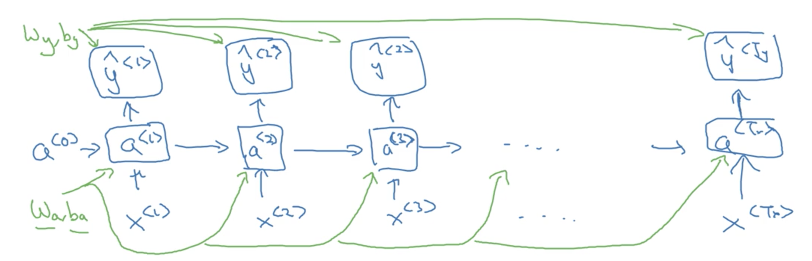

### Backward propogation through time (BPTT)

In order to perform **backward propagation through time** (**BPTT**), we first have to specify a loss function. We will choose __cross-entropy__ loss (we also saw this when discussing logisitc regression):

_For a single prediction (timestep)_

$$\ell^{<t>}(\hat y^{<t>}, y^{<t>}) = -y^{<t>} \log \hat y^{<t>} - (1 - y^{<t>}) \log(1- \hat y^{<t>})$$

_For all predictions_

$$\ell = \sum_{t=1}^{T_y}\ell^{<t>}(\hat y^{<t>}, y^{<t>})$$

While not covered in detail here, BPTT simply involves applying our loss function to each prediction at each timestep, and then using this information along with the chain rule to compute the gradients we will need to update our parameters and _assign blame proportionally_. The entire process might look something like the following:

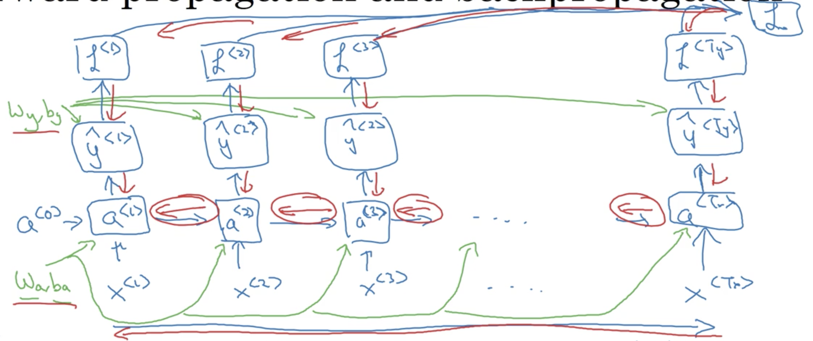

## Different types of RNNs

So far, we have only seen an RNN where the input and output are both sequences of lengths $\gt 1$. Particularly, our input and output sequences were of the same length ($T_x == T_y$), For many applications, $T_x \not = T_y$.

Take **sentiment classification** for example, where the input is typically a sequence (of text) and the output a integer scale (a 1-5 star review, for example).

_Example_:

$x$: "There is nothing to like in this movie"

We want our network to output a single prediction from 1-5. This is an example of a __many-to-one__ architecture.

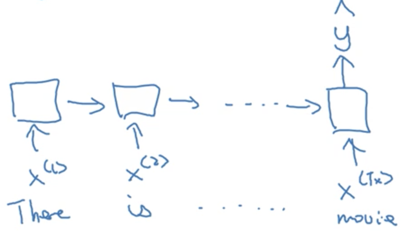

Another type of RNN architecture is __one-to-many__. An example of this architecture is __music generation__, where we might input an integer (indicating a genre) or the 0-vector (no input) and generate musical notes as our output. In this case, we input a single value to the network at timestep 1, and then propagate that input through the network (the remaining timesteps), with the caveat that in this architecture, we often take the ouput from the previous timestep and feed it to the next timestep:

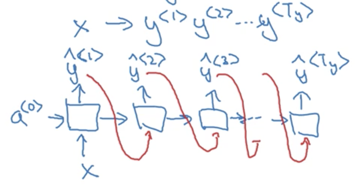

The final example is a __many-to-many__ architecture. Unlike our previous example where $T_x == T_y$, in machine translation $T_x \not = T_y$, as the number of words in the input sentence (say, in _english_) is not necessarily the same as the output sentence (say, in _french_). These problems are typicaly solved with __sequence to sequence models__, that are composed of distinct __encoder__ and __decoder__ RNNs.

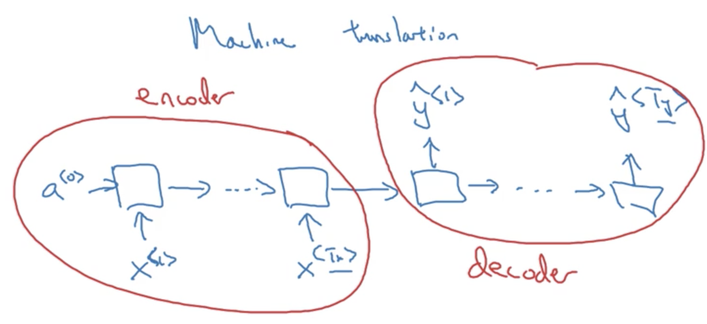

### Summary of RNN types

1. **One-to-one**: a standard, generic neural network. Strictly speaking, you wouldn't model this problem with an RNN.

2. __One-to-many__: Where our input is a single value (or in some cases, a null input represented by the 0-vector) which propogates through the network and our output is a sequence. Often, we use the prediction from the previous timestep when computing the hidden activations. An example is _music generation_ or _sequence generation_ more generally.

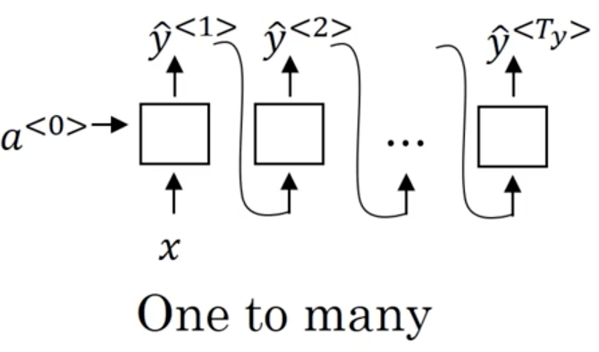

3. __Many-to-one__: Where our input is a sequence and our output is a single value. Typically we take the prediction from the last timestep of the RNN. An example is _sentiment classification_

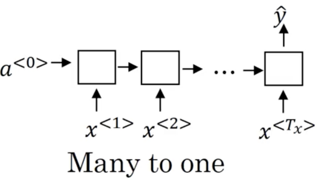

4. __Many-to-many__: Where both our input and outputs are sequences. These sequence are not necessarily the same length ($T_x \not = T_y$).

  - When $T_x == T_y$ our architecture looks like a standard RNN:

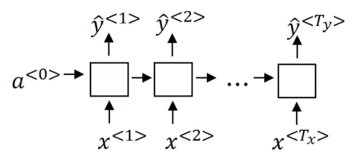

  - and when $T_x \not = T_y$ are architecture is a _sequence to sequence_ model which looks like:

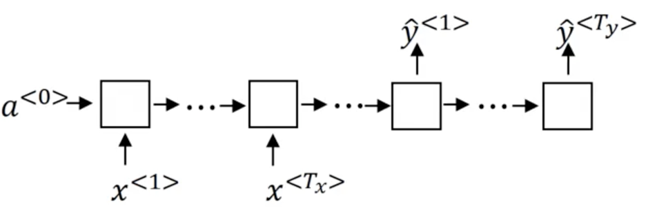

## Language model and sequence generation

**Language modeling** is one of the most basic and important tasks in natural language processing. It's also one that RNNs handle very well.

### What is a language modeling?

Let's say you are building a __speech recognition__ system and you hear the sentence:

$$\text{"The apple and pear/pair salad"}$$

How does a neural network determine whether the speaker said _pear_ or _pair_ (never mind that the correct answer is obvious to us). The answer is that the network encodes a __language model__. This language model is able to determine the _probability_ of a given sentence (think of this as a measure of "correctness" or "goodness"). For example, our language model might output:

$$P(\text{The apple and pair salad}) = 3.2 \times 10^{-13}$$

$$P(\text{The apple and pear salad}) = 5.7 \times 10^{-10}$$

This system would then pick the much more likely second option.

### Language modeling with an RNN

We start with a large corpus of english text. The first step is to __tokenize__ the text in order to form a vocabulary

$$\text{"Cats average 15 hours of sleep a day"} \rightarrow \text{["Cats", "average", "15", "hours", "of", "sleep", "a", "day", "."]}$$

These tokens are then __one-hot encoded__ or mapped to __indices__. Sometimes, a special end-of-sentence token is appended to each sequence (_<EOS\>_).

!!! note
    What if some of the words we encounter are not in our vocabulary? Typically we add a special token, _<UNK\>_ to deal with this problem.

Finally, we build an RNN to model the likelihood of any given sentence, learned from the training corpus.

#### RNN model

At time 0, we compute some activation $a^{<1>}$ as a function of some inputs $x^{<1>}$. In this case, $x^{<1>}$ will just be set to the zero vector. Similarly, $a^{<0>}$, by convention, is also set to the zero vector.

$a^{<1>}$ will make a _softmax_ prediction over the entire vocabulary to determine $\hat y^{<1>}$ (the probability of observing any of the tokens in your vocabulary as the _first_ word in a sentence).

At the second timestep, we will actually feed the first token in the sequence as the input ($x^{<2>} = y^{<1>}$). This occurs, so forth and so on, such that the input to each timestep are the tokens for all previous timesteps. Our outputs $\hat y^{<t>}$ are therefore  $P(x^{<t>}|x^{<t-1>}, x^{<t-2>}, ..., x^{<t-n>})$ where $n$ is the length of the sequence.

!!! note
    Just a note here, we are choosing $x^{<t>} = y^{<t-1>}$ _NOT_ $x^{<t>} = \hat y^{<t-1>}$

The full model looks something like:

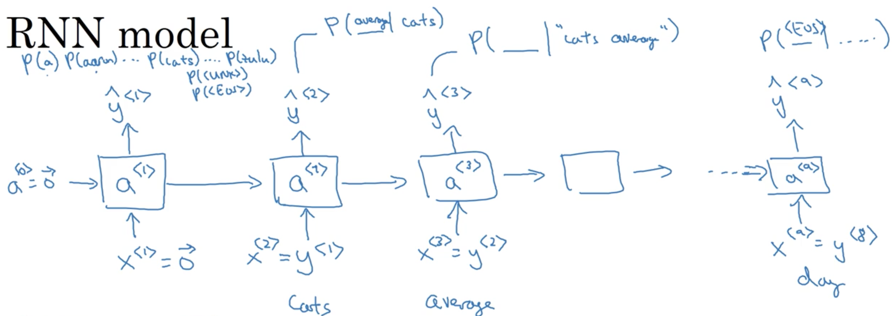

There are two important steps in this process:

1. Estimate $\hat y^{<t>} = P(y^{<t>} | y^{<1>}, y^{<2>}, ..., y^{<t-1>})$
2. Then pass the ground-truth word from the training set to the next time-step.

The __loss function__ is simply the __cross-entropy__ lost function that we saw earlier:

- For single examples: $\ell(\hat y^{<t>}, y^{<t>}) = - \sum_i y_i^{<t>} \log \hat y_i^{<t>}$
- For the entire training set: $\ell = \sum_i \ell^{<t>}(\hat y^{<t>}, y^{<t>})$

Once trained, the RNN will be able to predict the probability of any given sentence (we simply multiply the probabilities output by the RNN at each timestep).

## Sampling novel sequences

After you train a sequence model, one of the ways you can get an informal sense of what is learned is to sample novel sequences (also known as an _intrinsic evaluation_). Let's take a look at how you could do that.

### Word-level models

Remember that a sequence model models the probability of any given sequence of words. What we would like to to is to _sample_ from this distribution to generate _novel_ sequence of words.

!!! note
    At this point, Andrew makes a distinction between the architecture used for _training_ a language modeling and the architecture used for _sampling_ from a language model. The distinction is completely lost on me.

We start by computing the activation $a^{<1>}$ as a function of some inputs $x^{<1>}$ and $a^{<0>}$ (again, these are set to the zero vector by convention). The __softmax__ function is used to generate a probability distribution over all words in the vocabulary, representing the likelihood of seeing each at the first position of a word sequence. We then randomly sample from this distribution, choosing a single token ($\hat y^{<1>}$), and pass it as input for the next timestep.

!!! note
    For example, if we sampled "the" in the first timestep, we would set $\hat y^{<1>} = the = x^{<2>}$. This means that at the second timestep, we are computing a probability distribution $P(v | the)$ over all tokens $v$ in our vocabulary $V$.

The entire procedure looks something like:

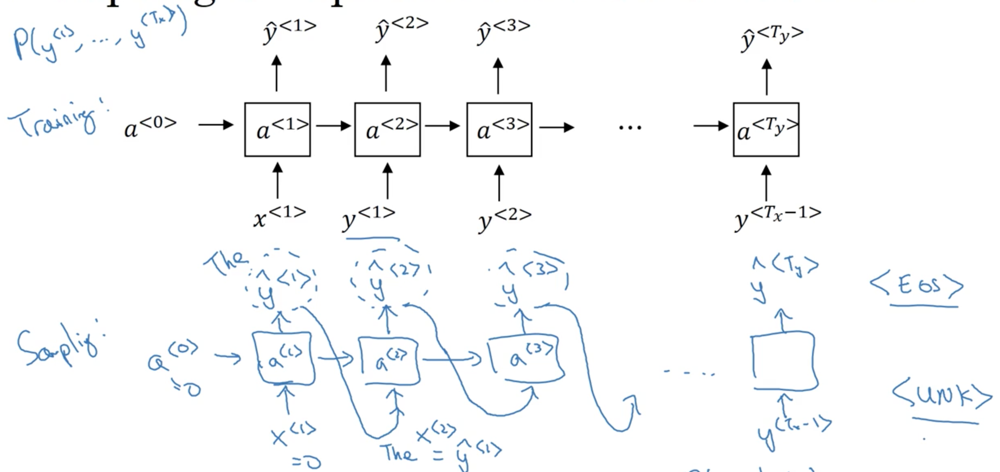

_How do we know when the sequence ends_?

If we included the <EOS> token in our training procedure (and this included it in our vocabulary) the sequence ends when and <EOS\> token is generated. Otherwise, stop when a pre-determined number of tokens has been reached.

_What if we generate an <UNK\> token_?

We can simply re-sample until we generate a non-<UNK\> token.

### Character-level models

We could also build a **character-level language model**. The only major difference is that we train on a sequence of _characters_ as opposed to _tokens_, and therefore our vocabulary consists of individual _characters_ (which typically include digits, punctuation, etc.)

_Character_-level language models are more computational expensive, and because a sequence of characters is typically much longer than a sequence of words (obviously) it is more difficult to capture the long range dependencies (as they are longer, of course).

However, using a _character_-level language models has the benefit of avoiding the problem of out-of-vocabulary tokens, as we can build a non-zero vector representation of _any_ token using the learned character representations.

!!! note
    You can also combine word-level and character-level language models!

## Vanishing gradients with RNNs

One of the problems with the basic RNN algorithm is the __vanishing gradient problem__. The RNN architecture as we have described it so far:

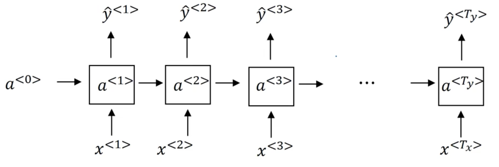

Take the following two input examples:

$$x^{(1)} = \text{The cat, which already ate ..., was full}$$

$$x^{(2)} = \text{The cats, which already ate ..., were full}$$

!!! note
    Take the "..." to be an sequence of english words of arbitrary length.

Cleary, there is a long range-dependency here between the _grammatical number_ of the **noun** "cat" and the _grammatical tense_ of the **verb** "was".

!!! note
    It is important to note that while this is a contrived example, language very often contains long-range dependencies.

It turns out that the basic RNNs that we have described thus far is not good at capturing such long-range dependencies. To explain why, think back to our earlier discussions about the _vanishing gradient problems_ in very deep neural networks. The basic idea is that in a network with many layers, the gradient becomes increasingly smaller as it is backpropagated through a very deep network, effectively "vanishing". RNNs face the same problem, leading to errors in the outputs of later timesteps having little effect on the gradients of earlier timesteps. This leads to a failure to capture long-range dependencies.

!!! note
    Because of this problem, a basic RNN captures mainly local influences.

Recall that _exploding gradients_ are a similar yet opposite problem. It turns out that _vanishing gradients_ are a bigger problems for RNNs, but _exploding gradients_ do occur. However,  _exploding gradients_ are typically easier to catch as we simply need to look for gradients that become very very large (also, they usually lead to computational overflow, and generate NaNs). The solution to _exploding gradient_ problems is fairly straightforward however, as we can use a technique like __gradient clipping__ to scale our gradients according to some maximum values.

## Gated Recurrent Unit (GRU)

You've seen how a basic RNN works. In this section, you learn about the **Gated Recurrent Unit** (**GRU**) which is a modification to the RNN hidden layer that makes it much better at capturing long range connections and helps a lot with the vanishing gradient problems.

Recall the activation function for an RNN at timestep $t$:

$$a^{<t>} = g(W_a[a^{<t-1>}, x^{<t>}] + b_a)$$

As a picture:

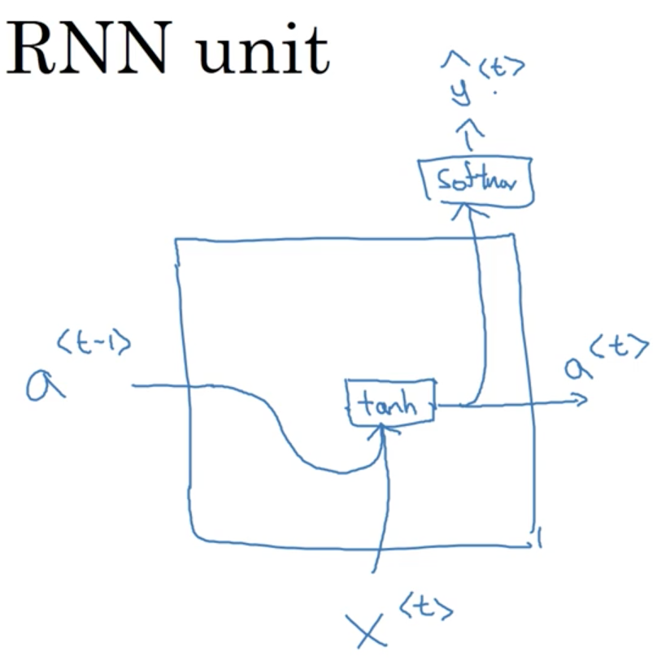

!!! note
    Two papers were important for the development of GRUs: [Cho et al., 2014](https://arxiv.org/pdf/1406.1078v3.pdf) and [Chung et al., 2014](https://arxiv.org/pdf/1412.3555.pdf).

Lets define a new variable, $c$ for the **memory cell**. The job of the memory cell is to remember information earlier in a sequence. So at time $<t>$ the memory cell will have some value $c^{<t>}$. In GRUs, it turns out that $c^{<t>} == a^{<t>}$.

!!! note
    It will be useful to use the distinct variables however, as in LSTM networks $c^{<t>} \not = a^{<t>}$

At every timestep $t$, we are going to consider overwriting the value of the memory cell $c^{<t>}$ with a new value, computed with an activation function:

$$\text{Candidate memory: }\tilde c^{<t>} = tanh(W_c[c^{<t-1>}, x^{<t>}] + b_c)$$

The most important idea in the GRU is that of an __update gate__, $\Gamma_u$, which always has a value between 0 and 1:

$$\Gamma_u = \sigma(W_u[c^{<t-1>}, x^{<t>}] + b_u)$$

!!! note
    Subscript $u$ stands for update.

To build our intuition, think about the example we introduced earlier:

$$x^{(1)} = \text{The cat, which already ate ..., was full}$$

We noted that here, the fact that the word _"cat"_ was singular was a huge hint that the verb _"was"_ would also be singular in number. We can imagine $c^{<t>}$ as _memorizing_ the case of the noun "_cat_" until it reached the verb "_was_". The job of the __gate__ would be to _remember_ this information between "_... cat ... were ..._" and _forget_ it afterwords.

To compute $c^{<t>}$:

$$c^{<t>} = \Gamma_u * \tilde c^{<t>} + (1 - \Gamma_u) * c^{<t>}$$

There is a very intuitive understanding of this computation. When $\Gamma_u$ is 1, we simply _forget_ the old value of $c^{<t>}$ by overwriting it with $\tilde c^{<t>}$. When $\Gamma_u$ is 0, we do the opposite (completely diregard the new candidate memory $\tilde c^{<t>}$ in favour of the old memory cell value $c^{<t>}$).

!!! note
    Remember that $\Gamma_u$ can take on any value between 0 and 1. The larger the value, the more weight that the candidate memory cell value takes over the old memory cell value.

For our example sentence above, we might hope that the GRU would set $\Gamma_u = 1$ once it reached "_cats_", and then $\Gamma_u = 0$ for every other timestep until it reached "_was_", where it might set $\Gamma_u = 1$ again. Think of this as the network memorizing the grammatical number of the **subject** of the sentence in order to determine the number of its verb, a concept known as __agreement__.

As a picture:

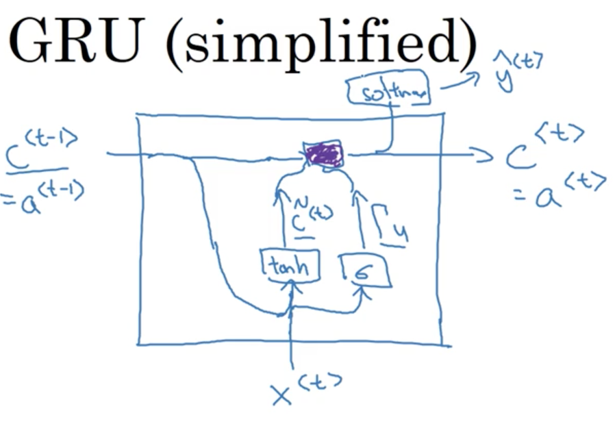

!!! note
    The purple box just represents our calculation of $c^{<t>}$

GRUs are remarkably good at determining when to update the memory cell in order to **memorize** or **forget** information in the sequence.

### Vanishing gradient problem

The way a GRU solves the vanishing gradient problem is straightforward: the __memory cell__ $c^{<t>}$ is able to retain information over many timesteps. Even if $\Gamma_u$ becomes very very small, $c^{<t>}$ will essentially retain its value across many many timesteps.

### Implementation details

$c^{<t>}, \tilde c^{<t>} \text{ and } \Gamma_u$ are all vectors of the same dimension. This means that in the computation of:

$$c^{<t>} = \Gamma_u \ast \tilde c^{<t>} + (1 - \Gamma_u) \ast c^{<t>}$$

$\ast$ are _element-wise_ multiplications. Thus, if $\Gamma_u$ is a 100-dimensional vector, it is really a 100-dimensional vector of _bits_ which tells us of the 100-dimensional memory cell $c^{<t>}$, which are the _bits_ we want to _update_.

!!! note
    Of course, in practice $\Gamma_u$ will take on values that are not _exactly_ 0 or 1, but its helpful to image it as a bit vector to build our intuition.

Invoking our earlier example one more time:

$$x^{(1)} = \text{The cat, which already ate ..., was full}$$

we could imagine representing the grammatical number of the noun "_cat_" as a single _bit_ in the memory cell.

### Full GRU unit

The description of a GRU unit provided above is actually somewhat simplified. Below is the computations for the _full_ GRU unit:

$$\Gamma_r = \sigma(W_r[c^{<t-1>}, x^{<t>}] + b_r)$$

$$\tilde c^{<t>} = tanh(W_c[\Gamma_r \ast c^{<t-1>}, x^{<t>}] + b_c)$$

$$\Gamma_u = \sigma(W_u[c^{<t-1>}, x^{<t>}] + b_u)$$

$$c^{<t>} = \Gamma_u * \tilde c^{<t>} + (1 - \Gamma_u) * c^{<t-1>}$$

We introduce another gate, $\Gamma_r$. Where we can think of this gate as capturing how relevant $c^{<t-1>}$ is for computing the next candidate $c^{<t>}$.

!!! note
    You can think of $r$ as standing for relevance.

Note that Andrew tried to establish a consistent notation to use for explaining both GRUs and LSTMs. In the academic literature, you might often see:

- $\tilde c^{<t>} : \tilde h$
- $\Gamma_u : u$
- $\Gamma_r : r$
- $c^{<t>} : h$

!!! note
    (our notation : common academic notation)

## Long Short Term Memory (LSTM)

In the last video, you learned about the **GRU**, and how that can allow you to learn very long range dependencies in a sequence. The other type of unit that allows you to do this very well is the **LSTM** or the **long short term memory** units, and is even more powerful than the GRU.

Recall the full set of equations defining a GRU above:

$$\Gamma_r = \sigma(W_r[c^{<t-1>}, x^{<t>}] + b_r)$$

$$\tilde c^{<t>} = tanh(W_c[\Gamma_r \ast c^{<t-1>}, x^{<t>}] + b_c)$$

$$\Gamma_u = \sigma(W_u[c^{<t-1>}, x^{<t>}] + b_u)$$

$$c^{<t>} = \Gamma_u * \tilde c^{<t>} + (1 - \Gamma_u) * c^{<t-1>}$$

$$a^{<t>} = c^{<t>}$$

The LSTM unit is a more powerful and slightly more general version of the GRU (in truth, the LSTM was defined before the GRU). Its computations are defined as follows:

$$\tilde c^{<t>} = tanh(W_c[a^{<t-1>}, x^{<t>}] + b_c)$$

$$\Gamma_u = \sigma(W_u[a^{<t-1>}, x^{<t>}] + b_u)$$

$$\Gamma_f = \sigma(W_f[a^{<t-1>}, x^{<t>}] + b_f)$$

$$\Gamma_o = \sigma(W_o[a^{<t-1>}, x^{<t>}] + b_o)$$

$$c^{<t>} = \Gamma_u * \tilde c^{<t>} + \Gamma_f * c^{<t-1>}$$

$$a^{<t>} = \Gamma_o  * tanh(c^{<t>})$$

!!! note
    [Original LSTM paper](https://dl.acm.org/citation.cfm?id=1246450).

Notice that with LSTMs, $a^{<t>} \not = c^{<t>}$. One new property of the LSTM is that instead of _one_ update gate, $\Gamma_u$, we have _two_ update gates, $\Gamma_u$ and $\Gamma_f$ (for **update** and **forget** respectively). This gives the memory cell the option of keeping the old memory cell information $c^{<t-1>}$ and just adding to it some new information $\tilde c^{<t>}$.

We can represent the LSTM unit in diagram form as follows:

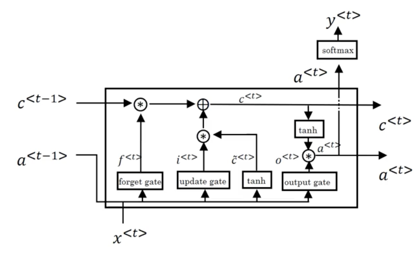

!!! note
    See [here](https://colah.github.io/posts/2015-08-Understanding-LSTMs/) for an more detailed explanation of an LSTM unit.

One thing you may notice is that if we draw out multiple units in temporal succession, it becomes clear how the LSTM is able to achieve something akin to "memory" over a sequence:

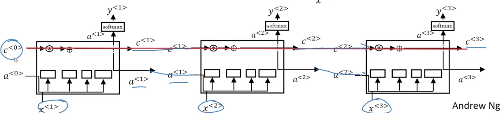

### Modifications to LSTMs

There are many modifications to the LSTM described above. One involves including $c^{<t-1>}$ along with $a^{<t-1>}, x^{<t>}$ in the gate computations, known as a __peephole connection__. This allows for the gate values to depend not just on the input and the previous timesteps activation, but also on the previous timesteps value of the memory cell.

## Bidirectional RNNs (BRNNs)

By now, you've seen most of the building blocks of RNNs. There are two more ideas that let you build much more powerful models. One is **bidirectional RNNs** (**BRNNs**), which lets you at a point in time to take information from both earlier and later in the sequence. And second, is deep RNNs, which you'll see in the next video.

To motivate bidirectional RNNs, we will look at an example we saw previously:

$x^{(1)}$: _He said, "Teddy Roosevelt was a great President"_

$x^{(2)}$: _He said, "Teddy bears are on sale!"_

Recall, that for the task of NER we established that correctly predicting the token _Teddy_ as a _person_ entity without seeing the words that follow it would be difficult.

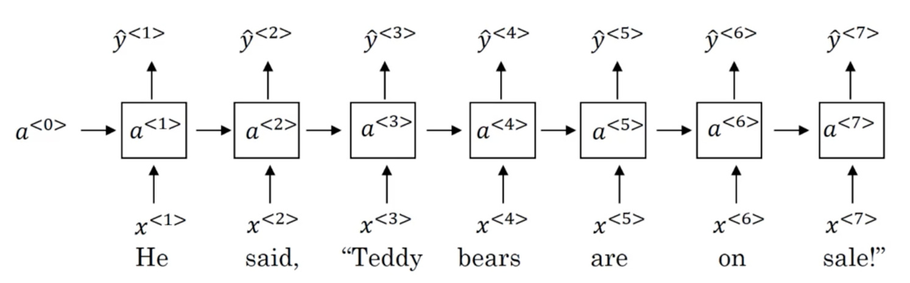

!!! note
    Note: this problem is independent of whether these are standard RNN, GRU, or LSTM units.

A solution to this problem is to introduce another RNN in the opposite direction, going _backwards_ in time.

During forward propogation, we compute activations as we have seen previously, with key difference being that we learn two series of activations: one from _left-to-right_ $\overrightarrow a^{<t>}$ and one from _right-to-left_ $\overleftarrow a^{<t>}$. What this allows us to do is learn the representation of each element in the sequence _within its context_. Explicitly, this is done by using the output of both the forward and backward units at each time step in order to make a prediction $\hat y^{<t>}$:

$$\hat y^{<t>} = g(W_y[\overrightarrow a^{<t>}, \overleftarrow a^{<t>}] + b_y)$$

For the example given above, this means that our prediction for the token _Teddy_, $y^{<3>}$, is able to makes use of information seen previously in the sequence ($t = 3, 2, ...$) and future information in the sequence ($t = 4, 5, ...$)

!!! note
    Note again that we can build bidirectional networks with standard RNN, GRU and LSTM units. Bidirectional LSTMs are extremely common.

The disadvantage of BRNNs is that we need to see the _entire_ sequence before we can make any predictions. This can be a problem in applications such as real-time speech recognition.

!!! note
    the BRNN will let you take into account the entire speech utterance but if you use our straightforward implementation, you need to wait for the person to stop talking to get the entire utterance before you can actually process it and make a speech recognition prediction

For applications like these, there exists somewhat more complex modules that allow predictions to be made before the full sequence has been seen. bidirectional RNN as you've seen here. For many NLP applications where you can get the entire sentence all the same time, our standard BRNN algorithm is actually very effective.

## Deep RNNs

The different versions of RNNs you've seen so far will already work quite well by themselves. But for learning very complex functions sometimes is useful to stack multiple layers of RNNs together to build even deeper versions of these models.

Recall, that for a standard neural network we have some input $x$ which is fed to a hidden layer with activations $a^{[l]}$ which are in turn fed to the next layer to produce activations $a^{[l+1]}$. In this was, we can stack as many layers as we like. The same is true of RNNs. Lets use the notation $a^{[l]<t>}$ to denote the activations of layer $l$ for timestep $t$.

A stacked RNN would thus look something like the following:

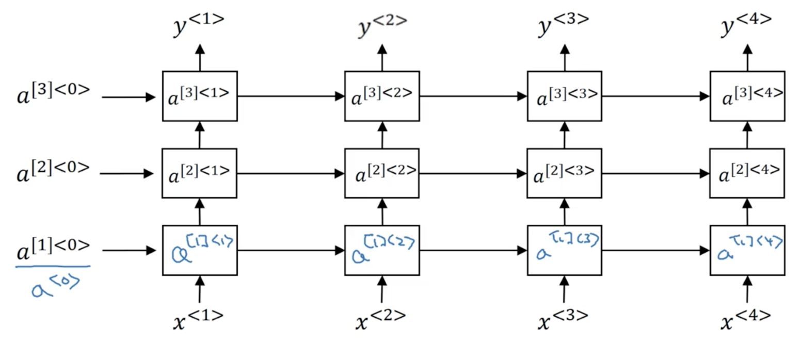

The computation of, for example, $a^{[2]<3>}$ would be:

$$a^{[2]<3>} = g(W_a^{[2]}[a^{[2]<2>}, a^{[1]<3>}] + b_a^{[2]})$$

Notice that the second layer has parameters $W_a^{[2]}$ and $b_a^{[2]}$ which are shared across all timesteps, but _not_ across the layers (which have their own corresponding set of parameters).

Unlike standard neural networks, we rarely stack RNNs very deep. Part of the reason is that RNNs are already quite large due to their temporal dimension.

!!! note
    A common depth would be 2 stacked RNNs.

Something that has become more common is to apply deep neural networks to the output of each timestep. In this approach, the _same_ deep neural network is typically applied to each output of the final RNN layer.
