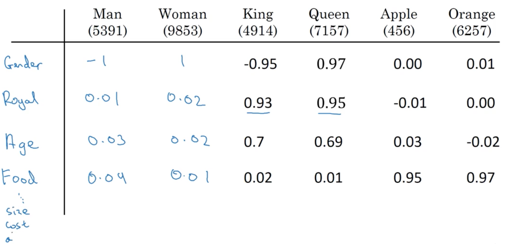
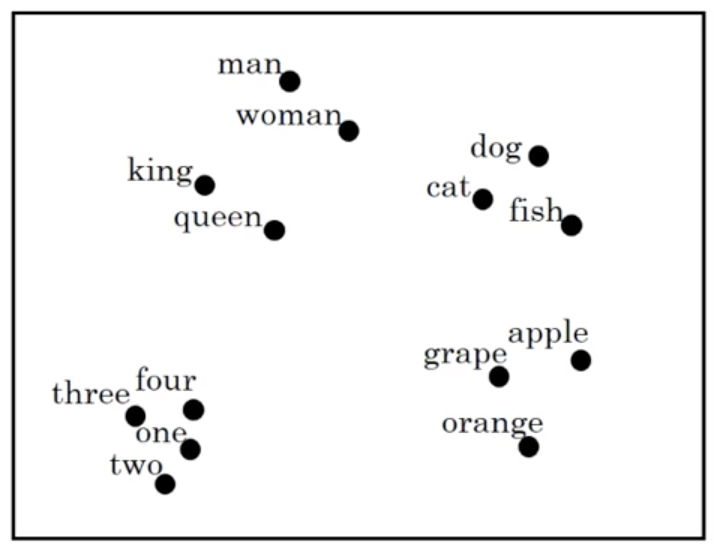
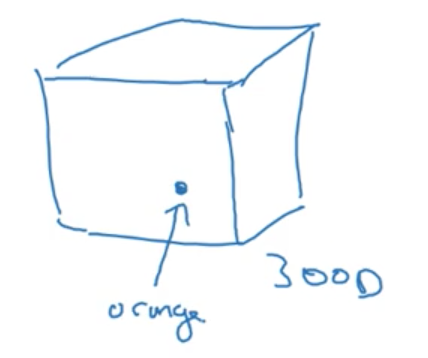
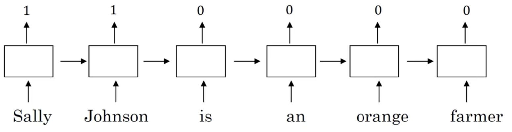
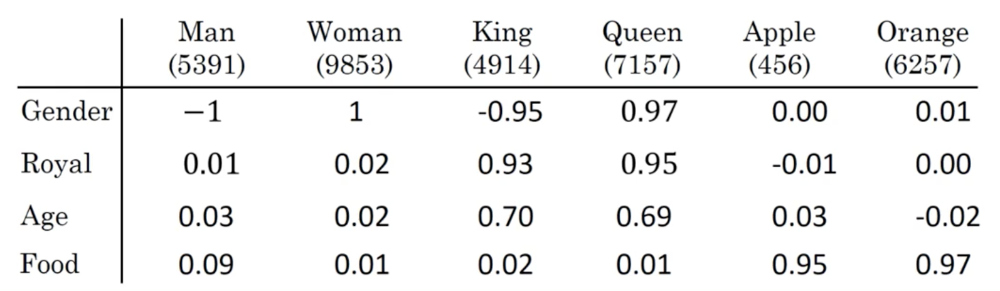
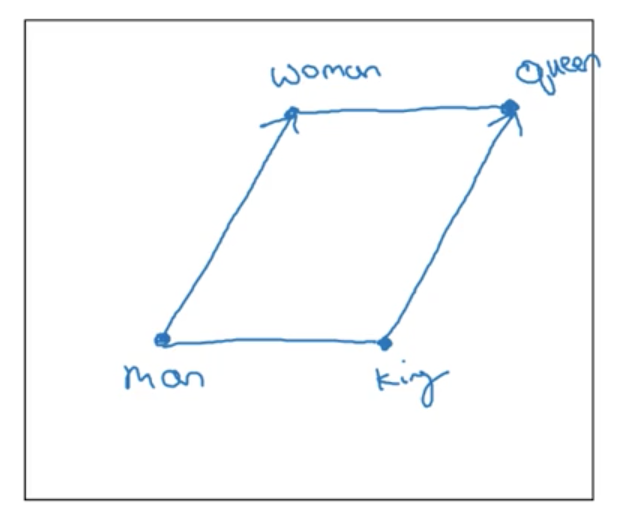
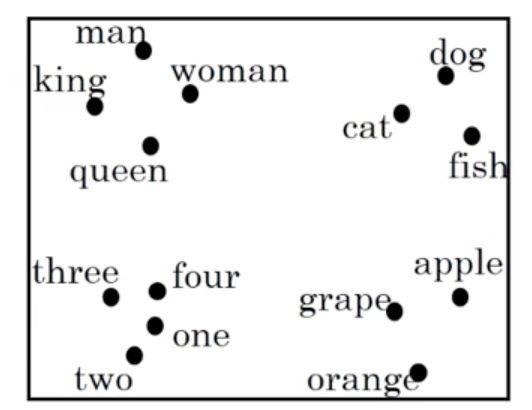
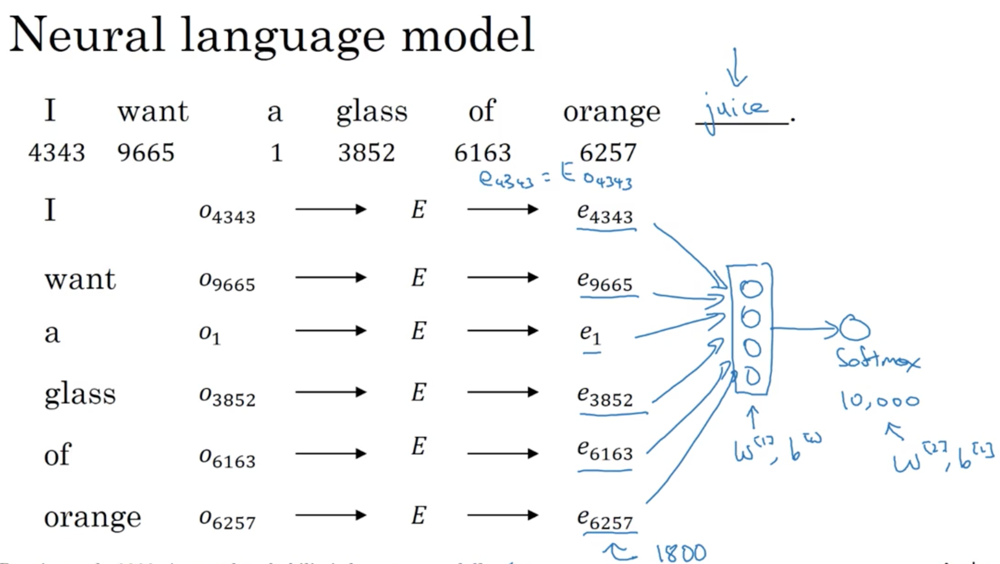
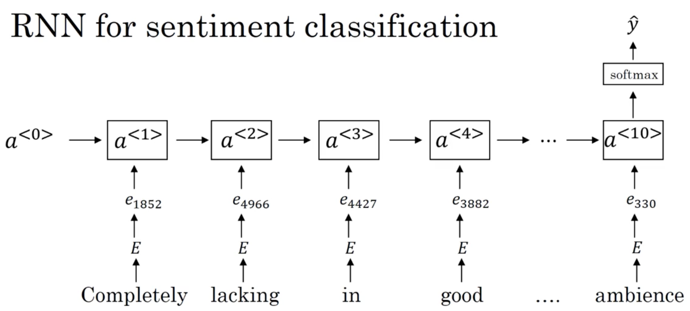

# Week 2: Natural Language Processing & Word Embeddings

Natural language processing and deep learning is an _important combination_. Using word vector representations and embedding layers, you can train recurrent neural networks with outstanding performances in a wide variety of industries. Examples of applications are **sentiment analysis**, **named entity recognition** (**NER**) and **machine translation**.

## Introduction to word embeddings: Word Representation

Last week, we learned about RNNs, GRUs, and LSTMs. In this week, you see how many of these ideas can be applied to **Natural Language Processing** (**NLP**), which is one of the areas of AI being revolutionized by deep learning. One of the key ideas you learn about is **word embeddings**, which is a way of representing words.

So far, we have been representing words with a vocabulary, \\(V\\), of one-hot-encoded vectors. Lets quickly introduce a new notation. If the token "_Man_" is in position 5391 in our vocabulary \\(V\\) then we denote the corresponding one-hot-encoded vector as \\(O_{5391}\\).

One of the weaknesses of this representation is that it treats each word as a "thing" onto itself, and doesn't allow a language model to generalize between words. Take the following examples:

\\[x_1: \text{"I want a glass of orange juice"}\\]
\\[x_2: \text{"I want a glass of apple juice"}\\]

Cleary, the example sentences are extremely semantically similar. However, in a one-hot encoding scheme, a model which has learned that \\(x_1\\) is a likely sentence is unable to fully generalize to example \\(x_2\\), as the relationship between "_apple_" and "_orange_" is not any closer than the relationship between "_orange_" and any other word in the vocabulary.

Notice, in fact, that the [inner product](http://www.wikiwand.com/en/Dot_product) between any two one-hot encoded vectors:

\\[O_i \times O_j = \vec 0 \text{ for } \forall i,j\\]

And similarly, the [euclidean distance](http://www.wikiwand.com/en/Euclidean_distance) between any two one-hot encoded vectors is identical:

\\[||O_i - O_j|| = \sqrt{|V|}\text{ for } \forall i,j\\]

To build our intuition of word embeddings, image a contrived example where we represent each word with some __feature representation__:

We could imagine many features (with values -1 to 1, say) that can be used to build up a featue representation, an \\(f_n\\)-dimensional vector, of each word. Similarly to our one-hot representations, lets introduce a new notation \\(e_i\\) to represent the _embedding_ of token \\(i\\) in our vocabulary \\(V\\).

> Where \\(f_n\\) is the number of features.

Thinking back to our previous example, notice that our representations for the tokens "_apple_" and "_orange_" become quite similar. This is the critical point, and what allows our language model to generalize between word tokens and even entire sentences.

> In the later videos, we will see how to learn these embeddings. Note that the learned representations do not have an easy interpretation like the dummy embeddings we presented above.

### Visualizing word embeddings

Once these feature vectors or _embeddings_ are learned, a popular thing to do is to use dimensionality reduction to _embed_ them into a 2D geometric space for easy visualization. An example of this using our word representations presented above:

We notice that semantically similar words tend to cluster together, and that each cluster seems to roughly represent some idea or concept (i.e., numbers typically cluster together). This demonstrates our ability to learn _similar_ feature vectors for _similar_ tokens and will allow our models to generalize between words and even sentences.

> A common algorithm for doing this is the [t-SNE](http://www.wikiwand.com/en/T-distributed_stochastic_neighbor_embedding) algorithm.

The reason this feature representations are called _embeddings_ is because we imagine that we are _embedding_ each word into a geometric space (say, of 300 dimensions). If you imagine a cube, we can think of giving each word a single unit of space within this cube.

## Introduction to word embeddings: Using word embeddings

In the last lecture, you saw what it might mean to learn a featurized representations of different words. In this lecture, you see how we can take these representations and plug them into NLP applications.

### Named entity recognition example

Take again the example of named entity recognition, and image we have the following example:

Let's assume we correctly identify "_Sally Johnson_" as a PERSON entity. Now imagine we see the following sequence:

\\[x: \text{"Robert Lin is a durian cultivator"}\\]

> Note that durian is a type of fruit.

In all likelihood, a model using word embeddings as input should be able to generalize between the two input examples, a take advantage of the fact that it previously labeled the first two tokens of a similar training example ("_Sally Johnson_") as a PERSON entity. But how does the model generalize between "_orange farmer_" and "_durian cultivator_"?

Because word embeddings are typically trained on _massive_ unlabeled text corpora, on the scale of 1 - 100 billion words. Thus, it is likely that the word embeddings would have seen and learned the similarity between word pairs ("_orange_", "_durian_") and ("_farmer_", "_cultivator_").

In truth, this method of __transfer learning__ is typically how we use word embeddings in NLP tasks.

### Transfer learning and word embeddings

How exactly do we utilize transfer learning of word embeddings for NLP tasks?

1. Learn word embeddings from large text corpus (1-100B words), OR, download pre-trained embeddings online.
2. Transfer the embedding to a new task with a (much) smaller training set (say, 100K words).
3. (Optional): Continue to fine-tune the word embeddings with new data. In practice, this is only advisable if your training dataset is quite large.

This method of transfer learning with word embeddings has found use in NER, text summarization, co-reference resolution, and parsing. However, it has been less useful for language modeling and machine translation (especially when a lot of data for these tasks is available).

One major advantage to using word embeddings to represent tokens is that it reduces the dimensionality of our inputs, compared to the one-hot encoding scheme. For example, a typical vocabulary may be 10,000 or more word types, while a typical word embedding may be around 300 dimensions.

## Introduction to word embeddings: Properties of word embeddings

By now, you should have a sense of how word embeddings can help you build NLP applications. One of the most fascinating properties of word embeddings is that they can also help with **analogy reasoning**. And while reasoning by analogy may not be, by itself, the most important NLP application, it helps to convey a sense of what information these word embeddings are capturing.

### Analogies

Let us return to our previous example:

Say we post the question: "_Man is to women as king is to **what**?_"

Many of us would agree that the answer to this question is "Queen" (in part because of humans remarkable ability to [reason by analogy](https://plato.stanford.edu/entries/reasoning-analogy/)). But can we have a computer arrive at the same answer using embeddings?

First, lets simplify our earlier notation and allow \\(e_{man}\\) to denote the learned embedding for the token "_man_". Now, if we take the difference \\(e_{man} - e_{woman}\\), the resulting vector is closest to \\(e_{king} - e_{queen}\\).

> Note you can confirm this using our made up embeddings in the table.

Explicitly, an algorithm to answer the question "_Man is to women as king is to **what**?_" would involve computing \\(e_{man} - e_{woman}\\), and then finding the token \\(w\\) that produces \\(e_{man} - e_{woman} \approx e_{king} - e_{w}\\).

> This ability to mimic analogical reasoning and other interesting properties of word embeddings were introduced in this [paper](https://www.microsoft.com/en-us/research/wp-content/uploads/2016/02/rvecs.pdf).

Lets try to visualize why this makes sense. Imagine our word embedding plotted as vectors in a 300D space (represented here in 2 dimensions for visualization). We would expect our vectors to line up in a parallelogram:

Note that in reality, if you use a dimensionality reduction algorithm such as t-SNE, you will find that this expected relationship between words in an analogy does not hold:

We want to find \\(e_w \approx e_{king} - e_{man} + e_{woman}\\). Our algorithm is thus:

\\[argmax_w \; sim(e_w, e_{king} - e_{man} + e_{woman})\\]

The most commonly used similarity function, \\(sim\\) is the _cosine similarity_:

\\[sim(u, v) = \frac{u^Tv}{||u||_2||v||_2}\\]

Which represents the **cosine** of the angle between the two vectors \\(u, v\\).

> Note that we can also use **euclidian distance**, although this is technically a measure of dissimilarity, so we need to take its negative. See [here](http://blog.christianperone.com/2013/09/machine-learning-cosine-similarity-for-vector-space-models-part-iii/) for an intuitive explanation of the cosine similarity measure.

### Introduction to word embeddings: Embedding matrix

Let's start to formalize the problem of learning a good word embedding. When we implement an algorithm to learn word embeddings, what we actually end up learning is an __embedding matrix__.

Say we are using a vocabulary \\(V\\) where \\(||V|| = 10,000\\). We want to learn an embedding matrix \\(E\\) of shape \\((300, 10000)\\) (i.e., the dimension of our word embeddings by the number of words in our vocabulary).

\\[E = \begin{bmatrix}e_{1, 1} & ... & e_{10000, 1}\\\\ ... & ... \\\\ e_{1, 300} & & ...\end{bmatrix}\\]

> Where \\(e_{i, j}\\) is the \\(j-th\\) feature in the \\(i-th\\) token.

Recall that we used the notation \\(o_i\\) to represent the one-hot encoded representation of the \\(i-th\\) word in our vocabulary.

\\[o_i = \begin{bmatrix}0 \\\ ... \\\ 1 \\\ ... \\\ 0\end{bmatrix}\\]

If we take \\(E \cdot o_i\\) then we are retrieving the embedding for the \\(i-th\\) word in \\(V\\), \\(e_i \in \mathbb R^{300 \times 1}\\).

### Summary

 The  import thing to remember is that our goal will be to learn an **embedding matrix** \\(E\\). To do this, we initialize \\(E\\) randomly and learn all the parameters of this, say, 300 by 10,000 dimensional matrix. Finally, \\(E\\) multiplied by our one-hot vector \\(o_i\\) gives you the embedding vector for token \\(i\\), \\(e_i\\).

> Note that while this method of retrieving embeddings from the embedding matrix is intuitive, the matrix-vector multiplication is not efficient. In practice, we use a specialized function to lookup a column \\(i\\) of the matrix \\(E\\), an embedding \\(e_i\\).

## Learning word embeddings: Learning word embeddings

Lets begin to explore some concrete algorithms for learning word embeddings. In the history of deep learning as applied to learning word embeddings, people actually started off with relatively _complex_ algorithms. And then over time, researchers discovered they can use simpler and simpler algorithms and still get _very good_ results, especially for a large dataset. Some of the algorithms that are most popular today are so simple that they almost seem little bit magical. For this reason, it's actually easier to develop our intuition by introducing some of the more complex algorithms first.

> Note that a lot of the ideas from this lecture came from [Bengio et. al., 2003](http://jmlr.org/papers/volume3/bengio03a/bengio03a.pdf).

### Algorithm 1

We will introduce an early algorithm for learning word embeddings, which was very successful, with an example. Lets say you are building a **neural language model**. We want to be able to predict the next word for any given sequence of words. For example:

> Note that, another common strategy is to pick a fixed window of words before the word we need to predict. The window size becomes a hyperparameter of the algorithm.

\\[x: \text{"I want a glass of orange ____"}\\]

One way to approach this problem is to lookup the embeddings for each word in the given sequence, and feed this to a densely connected layer which itself feeds to a single output unit with **softmax**.

Imagine our embeddings are 300 dimensions. Then our input layer is \\(\mathbb R^{6 \times 300}\\). Our dense layer and output softmax layer have their own parameters, \\(W^{[1]}, b^{[1]}\\) and \\(W^{[2]}, b^{[2]}\\). We can then use back-propagation to learn these parameters along with the embedding matrix. The reason this works is because the algorithm is incentivized to learn good word embeddings in order to generalize and perform well when predicting the next word in a sequence.

### Generalizing

Imagine we wanted to learn the word "_juice_" in the following sentence:

\\[x: \text{"I want a glass of orange *juice* to go along with my cereal"}\\]

Typically, we would provide a neural language model with some _context_ and have it predict this missing word from that context. There are many choices here:

- \\(n\\) words on the left & right of the word to predict
- last \\(n\\) word before the word to predict
- a single, _nearby_ word

What researchers have noticed is that if your goal is to build a robust language model, choosing some \\(n\\) number of words before the target word as the context works best. However, if you goal is simply to learn word embeddings, then choosing other, simpler contexts (like a single, _nearby_ word) work quite well.

To summarize, by posing the language modeling problem in which some **context** (such as the last four words) is used to predict some **target** word, we can effectively learn the input word embeddings via backprogopogation.

## Learning Word Embeddings: Word2vec

In the last lecture, we used a neural language model in order to learn good word embeddings. Let's take a look at the the **Word2Vec** algorithm, which is a simpler and more computational efficient way to learn word embeddings.

> Most of the ideas in this lecture come from this paper: [Mikolov et al., 2013](https://arxiv.org/abs/1301.3781).

We are going to discuss the word2Vec **skip-gram** model for learning word embeddings.

### Skip-gram

Let say we have the following example:

\\[x: \text{"I want a glass of orange juice to go along with my cereal"}\\]

In the skip-gram model, we choose (_context_, _target_) pairs in order to create the data needed for our supervised setting. To do this, for each _context_ word we randomly choose a _target_ word within some window (say, +/- 5 words).

_Our learning problem:_

\\[x \rightarrow y\\]
\\[\text{Context }, c\;(\text{"orange"}) \rightarrow \text{Target}, t\; (\text{"juice"})\\]

The learning problem then, is to choose the correct _target_ word within a window around the _context_ word. Clearly, this is a very challenging task. However, remember that the goal is _not_ to perform well on this prediction task, but to use the task along with backprogpogation to force the model to learn good word embeddings.

#### Model details

Lets take \\(||V|| = 10000\\). Our neural network involves an embedding layer, \\(E\\) followed by a softmax layer, similar to the one we saw in the previous lecture:

\\[E \cdot o_c \rightarrow e_c \rightarrow softmax \rightarrow \hat y\\]

Our softmax layer computes:

\\[p(t | c) = \frac{e^{\theta_t^Te_c}}{\sum^{10000}_{j=1}e^{\theta_j^Te_c}}\\]

> where \\(\theta_t\\) is the parameters associated with output \\(t\\) and the bias term has been omitted.

Which is a \\(|V|\\) dimensional vector containing the probability distribution of the target word being any word in the vocabulary for a given context word.

Our loss is the familiar negative log-likelihood:

\\[\ell (\hat y, y) = -\sum^{10000}_{i=1} y_i \log \hat y_i\\]

To _summarize_, our model looks up an embeddings in the embedding matrix which contains our word embeddings and is updated by backpropagation during learning. These embeddings are used by a softmax layer to predict a target word for a given context.

#### Problems with softmax classification

It turns out, there are a couple problems with the algorithm as we have described it, primarily due to the expensive computation of the _softmax_ layer. Recall our softmax calculation:

\\[p(t | c) = \frac{e^{\theta_t^Te_c}}{\sum^{10000}_{j=1}e^{\theta_j^Te_c}}\\]

Every time we wish to perform this softmax classification (that is, every step during training or testing), we need to perform a sum over \\(|V|\\) elements. This quickly becomes a problem when our vocabulary reaches sizes in the milllions or even billions.

One solution is to use a __hierarchial softmax__ classifier. The basic idea is to build a Huffman tree based on word frequencies. In this scheme, the number of computations to perform in the softmax layers scales as \\(\\log |V|\\) instead of \\(V\\).

> I don't really understand this.

#### How to sample the context c?

Sampling our target words, \\(t\\) is straightforward once we have sampled their context, \\(c\\), but how do we choose \\(c\\) itself?

Once solution is to sample uniform randomly. However, this leads to us choosing extremely common words (such as _the_, _a_, _of_, _and_, also known as stop words) much too often. This is a problem, as many updates would be made to \\(e_c\\) for these common words and many less updates would be made for less common words.

In practice, we use different heuristics to balance the sampling between very common and less common words.

### Summary

In the original word2vec paper, you will find two versions of the word2vec model: the **skip-gram** one introduced here and another called **CBow**, the continuous bag-of-words model. This model takes the surrounding contexts from a middle word, and uses them to try to predict the middle word. Each model has its advantages and disadvantages.

The key problem with the **skip-gram** model as presented so far is that the softmax step is _very expensive_ to calculate because it sums over the entire vocabulary size.

## Learning Word Embeddings: Negative Sampling

In the last lecture, we saw how the **skip-gram** model allows you to construct a supervised learning task by mapping from contexts to targets, and how this in turn allows us to learn a useful word embeddings. The major the downside of this approach was that was the **softmax** objective was _very slow to compute_.

Lets take a look at a modified learning problem called **negative sampling**, which allows us to do something similar to the skip-gram model but with a much more efficient learning algorithm.

> Again, most of the ideas in this lecture come from this paper: [Mikolov et al., 2013](https://arxiv.org/abs/1301.3781).

Similar to the skip-gram model, we are going to create a supervised learning setting from unlabeled data. Explicitly, the problem is to predict whether or not a given pair of words is a  _context_, _target_ pair.

First, we need to generate training examples:

- **Positive** examples are generated exactly how we saw with the skip-gram model, i.e., by sampling a context word and choosing a target word within some window around the context.
- To generate the **negative examples**, we take a sampled context word and then for some \\(k\\) number of times, we choose a target word _randomly_ from our vocabulary (under the assumption that this random word _won't_ be associated with our sampled _context_ word).

As an example, take the following sentence:

\\[x: \text{"I want a glass of orange juice to go along with my cereal"}\\]

Then we might construct the following (context, target) training examples:

- \\((orange, juice, 1)\\)
- \\((orange, king, 0)\\)
- \\((orange, book, 0)\\)
- \\((orange, the, 0)\\)
- \\((orange, of, 0)\\)

Where 1 denotes a __positive__ example and 0 a __negative__ example.

> Note that this leads to an obvious problem: some of our randomly chosen target words in our generated negative examples will in fact be within the context of the sampled context word. It turns out this is OK, as much more often than not our generated negative examples are truly negative examples.

Next, we define a supervised learning problem, where our inputs \\(x\\) are these generated positive and negative examples, and our targets \\(y\\) are whether or not the input represents a true (_context_, _target_) pair (1) or not (0):

\\[x \rightarrow y\\]
\\[(context, target) \rightarrow 1 \text{ or } 0\\]

> Explicitly, we are asking the model to predict whether or not the two words came from a distribution generated by sampling from within a context (defined3 as some window around the words) or a distribution generated by sampling words from the vocabulary at random.

How do you choose \\(k\\)? Mikolov _et. al_ suggest \\(k=5-20\\) for small datasets, and \\(k=2-5\\) for large datasets. You can think of \\(k\\) as a 1:\\(k\\) ratio of **positive** to **negative** examples.

#### Model details

Recall the softmax classifier from the skip-gram model:

\\[\text{Softmax: } p(t | c) = \frac{e^{\theta_t^Te_c}}{\sum^{10000}_{j=1}e^{\theta_j^Te_c}}\\]

For our model which uses negative sampling, first define each input, output pair as \\(c, t\\) and \\(y\\) respectively. Then, we define a logistic regression classifier:

\\[p(y = 1 | c, t) = \sigma(\theta_t^Te_c)\\]

Where \\(\theta_t\\) represents the parameter vector for a possible target word \\(t\\), and \\(e_c\\) the embedding for each possible context word.

> NOTE: totally lost around the 7 min mark. Review this.

This technique is called __negative sampling__ because we generate our training data for the supervised learning setting by first creating a positive example and then _sampling_ \\(k\\) _negative_ examples.

#### Selecting negative examples

The final import point is how we _actually_ sample __negative__ examples in _practice_.

- One option is to sample the target word based on the empirical frequency of words in your training corpus. The problem of this solution is that we end up sampling many highly frequent stop words, such as "and", "of", "or", "but", etc.
- Another extreme is to sample the negative examples uniformly random. However, this also leads to a very non-representive sampling of target words.

What the [authors](https://arxiv.org/abs/1301.3781) found to work best is something in between:

\\[P(w_i) = \frac{f(w_i)^{\frac{3}{4}}}{\sum^{|V|}_{j=1}f(w_j)^{\frac{3}{4}}}\\]

Here, we sample proportional to the frequency of a word to the power of \\(\frac{3}{4}\\). This is somewhere between the two extremes of sampling words by their frequency and sampling words at uniform random.

### Summary

To summarize,

- we've seen how to learn word vectors with a **softmax classier**, but it's very computationally expensive.
- we've seen that by changing from a softmax classification to a bunch of binary classification problems, we can very efficiently learn words vectors.
- as is the case in other areas of deep learning, there are open source implementations of the discussed algorithms you can use to learn these embeddings. There are also pre-trained word vectors that others have trained and released online under permissive licenses.

## Learning Word Embeddings: GloVe word vectors

The final algorithm we will look at for learning word embeddings is **global vectors for word representation** (__GloVe__). While not used as much as **word2vec** models, it has its enthusiasts -- in part because of its simplicity.

> This algorithm was original presented [here](http://www.aclweb.org/anthology/D14-1162).

Previously, we were sampling pairs of words (_context_, _target_) by picking two words that appear in close proximity to one another in our text corpus. In the GloVe algorithm, we define:

- \\(X_{ij}\\): the number of times word \\(i\\) appears in the context of word \\(j\\).
- \\(X_{ij}\\) == \\(X_{ji}\\)

> Note that \\(X_{ij}\\) == \\(X_{ji}\\) is not necessarily true in other algorithms (e.g., if we were to define the context as being the immediate next word). Notice that \\(i\\) and \\(j\\) play the role of \\(c\\) and \\(t\\).

### Model

The models objective is as follows:

Minimize \(\sum^{|V|}_{i=1} \sum^{|V|}_{j=1} f(X_{ij}) (\theta_i^Te_j + b_i + b_j' - \log X_{ij})^2\)

- Think of \\(\theta_i^Te_j\\) as a measure of how similar two words are, based on how often the occur together: \\(\log X_{ij}\\). More specifically, we are trying to minimize this difference using gradient descent by searching for the pair of words \\(i, j\\) whose inner product \\(\theta_i^Te_j\\) is a good predictor of how often they are going to appear together, \\(\log X_{ij}\\).
- If \\(X_{ij} = 0\\), \\(\log X_{ij} = \log 0 = - \infty\\) which is undefined. We use \\(f(X_{ij})\\) as weighting term, which is 0 when \\(X_{ij}\\) = 0, so we don't sum over pairs of words \\(i, j\\) when \\(X_{ij} = 0\\). \\(f(X_{ij})\\) is also used to weight words, such that extremely common words don't "drown" out uncommon words. There are various heuristics for choosing \\(f(X_{ij})\\). You can look at the [original paper](http://www.aclweb.org/anthology/D14-1162) for details for how to choose this heuristic.

> Note, we use the convention \\(0 \log 0 = 0\\)

Something to note about this algorithm is that the roles of \\(theta\\) and \\(e\\) are now completely _symmetric_. So, \\(\theta_i\\) and \\(e_j\\) are symmetric in that, if you look at the math, they play pretty much the same role and you could reverse them or sort them around, and they actually end up with the same optimization objective. In fact, one way to train the algorithm is to initialize \\(\theta\\) and \\(e\\) both uniformly and use gradient descent to minimize its objective, and then when you're done for every word, to then take the average:

\\[e_w^{final} = \frac{e_w + \theta_w}{2}\\]

because \\(theta\\) and \\(e\\) in this particular formulation play symmetric roles unlike the earlier models we saw in the previous videos, where \\(theta\\) and \\(e\\) actually play different roles and couldn't just be averaged like that.

### A note of the featurization view of word embeddings

Recall that when we first introduced the idea of word embeddings, we used a sort of _featurization view_ to motivate the reason why we learn word embeddings in the first place. We said, "Well, maybe the first dimension of the vector captures gender, the second, age...", so forth and so on.

However in practice, we cannot guarantee that the individual components of the embeddings are interpretable. Why? Lets say that there is some "space" where the first axis of the embedding vector is gender, and the second age. There is no way to guarantee that the actual dimension for each "feature" that the algorithm arrives at will be easily interpretable by humans. Indeed, if we consider the learned representation of each context, target pair, we note that:

\\[\theta_i^Te_j = (A\theta_i)^T(A^{-T}e_j) = \theta_i^TA^TA^{-T}e_j\\]

Where \\(A\\) is some arbitrary invertible matrix. The key take away is that the dimensions learned by the algorithm are not human interpretable, and each dimension typically encodes _some part_ of what we might think of a feature, as opposed to encoding an entire feature itself.

## Applications using Word Embeddings: Sentiment Classification

**Sentiment classification** is the task of looking at a piece of text and telling if someone likes or dislikes the thing they're talking about. It is one of the most important building blocks in NLP and is used in many applications. One of the challenges of sentiment classification is a lack of labeled data. However, with word embeddings, you're able to build good sentiment classifiers even with only modest-size label training sets. Lets look at an example:

\\[x: \text{"The dessert is excellent.", } y: 4/5 \text{ stars}\\]
\\[x: \text{"Service was quite slow.", } y: 2/5 \text{ stars}\\]
\\[x: \text{"Good for a quick meal, but nothing special.", } y: 3/5 \text{ stars}\\]
\\[x: \text{"Completely lacking in good taste, good service, and good ambience.", } y: 1/5 \text{ stars}\\]

> While we are using restaurant reviews as an example, sentiment analysis is often applied to [voice of the customer](http://www.wikiwand.com/en/Voice_of_the_customer) materials such as reviews and social media.

Common training set sizes for sentiment classification would be around 10,000 to 100,000 words. Given these small training set sizes, word embeddings can be extremely useful. Lets use the above examples to introduce a couple of different algorithms

### Simple sentiment classification model

Take,

\\[x: \text{"The dessert is excellent.", } y: 4/5 \text{ stars}\\]

As usual, we map the tokens in the input examples to one-hot vectors, multiply this by a pre-trained embedding matrix and obtain our embeddings, \\(e_w\\). Using a pre-trained matrix is essentially a form of transfer learning, as we are able to encode information learned on a much larger corpus (say, 100B tokens) and use it for learning on a much smaller corpus (say, 10,000 tokens).

We could then _average_ or _sum_ these embeddings, and pass the result to a _softmax_ classifier which outputs \\(\hat y\\), the probability of the review being rated as 1, 2, 3, 4 or 5 stars.

This algorithm will work OK, but fails to capture _negation_ of positive words (as it does not take into account word order). For example:

\\[x: \text{"Completely lacking in good taste, good service, and good ambience.", } y: 1/5 stars\\]

might incorrectly be predicted to correspond with a high star rating, because of the appearance of "good" three times.

### RNN sentiment classification model

A more sophisticated model involves using the embeddings as inputs to an RNN, which uses a softmax layer at the last timestep to predict a star rating:

Recall that we actually saw this example when discussing many-to-one RNN architectures. Unlike the previous, simpler model, this model takes into account word order and performs much better on examples such as:

\\[x: \text{"Completely lacking in good taste, good service, and good ambience.", } y: 1/5 \text{ stars}\\]

which contain many negated, positive words. When paired with pre-trained word embeddings, this model works quite while.

### Summary

Pre-trained word embeddings are especially useful for NLP tasks where we don't have a lot of training data. In this lecture, we motivated that idea by showing how pre-trained word embeddings can be used as inputs to very simple models to perform sentiment classification.

## Applications using Word Embeddings: Debiasing word embeddings

Machine learning and AI algorithms are increasingly trusted to help with, or to make, extremely important decisions. As such, we would like to make sure that, as much as possible, they're free of undesirable forms of bias, such as gender bias, ethnicity bias and so on. Lets take a look at reducing bias in word embeddings.

> Most of the ideas in this lecture came from this [paper](http://papers.nips.cc/paper/6228-man-is-to-computer-programmer-as-woman-is-to-homemaker-debiasing-word-embeddings.pdf).

When we first introduced the idea of word embeddings, we leaned heavily on the idea of analogical reasoning to build our intuition. For example, we were able to ask "Man is to woman as king is to ____?" and using word emebddings, arrive at the example queen. However, we can also ask other questions that reveal a _bias_ in embeddings. Take the following analogies encoding in some learned word embeddings:

\\[\text{"Man is to computer programmer as woman is to homemaker"}\\]
\\[\text{"Father is to doctor as mother is to nurse"}\\]

Clearly, these embeddings are encoding unfortunate gender stereotypes. Note that these are only examples, biases against ethnicity, age, sexual orientation, etc. can also become encoded by the learned word embeddings. In order for these biases to be learned by the model, they must first exist in the data used to train it.

### Addressing bias in word embeddings

Lets say we have already learned 300D embeddings. We are going to stick to gender bias for simplicities sake. The process for debiasing these embeddings is as follows:

1 **Identify bias direction**:

Take a few examples where the only difference (or only major difference) between word embeddings is gender, and subtract them:

  - \(e_{he} - e_{she}\)
  - \(e_{male} - e_{female}\)
  - ...

Average the differences. The resulting vector encodes a 1D subspace that may be the __bias__ axis. The remaining 299 axes are the __non-bias direction__

> Note in the original paper, averaging is replaced by SVD, and the __bias__ axis is not necessarily 1D.

2 **Neutralize**:

For every word that is not definitional, project them onto __non-bias direction__ or axis to get rid of bias. These do __not__ include words that have a legitimate gender component, such as _"grandmother"_ but __do__ include words for which we want to eliminate a learned bias, such as _"doctor"_ or _"babysitter"_ (in this case a gender bias, but it could also be a sexual orientation bias, for example).

Choosing which words to neutralize is challenging. For example, _"beard"_ is characteristically male, so its likely not a good idea to neutralize it with respect to gender. The authors of the original paper actually trained a classifier to determine which words were definitional with respect to the bias (in our case gender). It turns out that english does not contain many words that are definitional with respect to gender.

3 **Equalize pairs**:

Take pairs of definitional words (such as _"grandmother"_ and _"grandfather"_ and equalize their difference to the __non-bias direction__ or axis. This ensures that these words are equidistant to all other words for which we have "neturalized" and encoded bias.

This process is a little complicated, but the end results is that these pairs of words, (e.g. _"grandmother"_ and _"grandfather"_) are moved to a pair of points that are equidistant from the __non-bias direction__ or axis.

It turns out, the number of these pairs is very small. It is quite feasible to pick this out by hand.

### Summary

Reducing or eliminating bias of our learning algorithms is a very important problem because these algorithms are being asked to help with or to make more and more important decisions in society. In this lecture we saw just one set of ideas for how to go about trying to address this problem, but this is still a very much an ongoing area of active research by many researchers.
