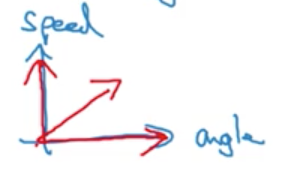
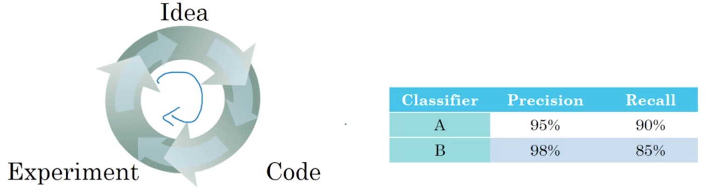
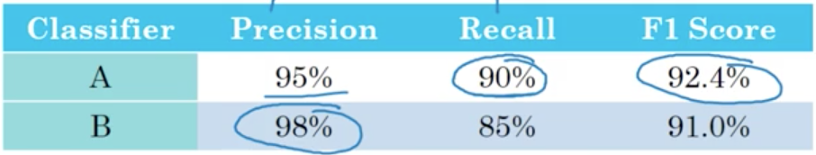
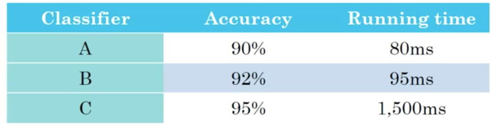
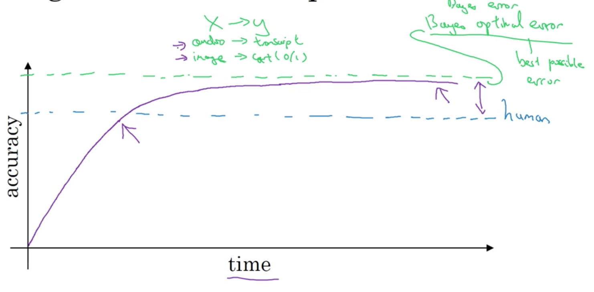

# Week 1: ML Strategy (1)

What is _machine learning strategy?_ Lets start with a motivating example.

## Introduction to ML strategy

### Why ML strategy

Lets say you are working on a __cat classifier__. You have achieved 90% accuracy, but would like to improve performance even further. Your ideas for achieveing this are:

- collect more data
- collect more diverse training set
- train the algorithm longer with gradient descent
- try adam (or other optimizers) instead of gradient descent
- try dropout, add L2 regularization, change network architecture, ...

This list is long, and so it becomes incredibly important to be able to identify ideas that are worth our time, and which ones we can likely discard.

This course will attempt to introduce a framework for making these decisions. In particular, we will focus on the organization of _deep learning-based projects_.

### Orthogonalization

One of the challenges with building deep learning systems is the number of things we can tune to improve performance (_many hyperparameters notwithstanding_).

Take the example of an old TV. They included many nobs for tuning the display position (x-axis position, y-axis position, rotation, etc...).

__Orthogonalization__ in this example refers to the TV designers decision to ensure each nob had one effect on the display and that these effects were _relative_ to one another. If these nobs did more than one action and each actions magnitude was not relative to the other, it would become nearly impossible to tune the TV.

Take another example, driving a __car__. Imagine if there was multiple joysticks. One joystick modified \\(0.3\\) X steering angle \\(- 0.8\\) speed, and another \\(2\\) X steering angle \\(+ 0.9\\) speed. In theory, by tuning these two nobs we could drive the car, but this would be _much more difficult then separating the inputs into distinct input mechanisms_.

__Orthogonal__ refers to the idea that the _inputs_ are aligned to the dimensions we want to control.

_How does this related to machine learning?_

#### Chain of assumption in examples

For a machine learning system to perform "well", we usually aim to make four things happen:

1. Fit training set well on cost function (for some applications, this means comparing favorably to human-level performance).
2. Fit dev set well on cost function
3. Fit test set well on cost function
4. Performs well in real world.

If we relate back to the TV example, we wanted _one knob_ to change each attribute of the display. _In the same way, we can modify knobs for each of our four steps above_:

1. Train a bigger network, change the optimization algorithm, ...
2. Regularization, bigger training set, ...
3. Bigger dev set, ...
4. Change the dev set or the cost function

!!! note
    Andrew said when he trains neural networks, he tends __not__ to use __early stopping__. The reason being is that this is not a very __orthogonal__ "knob"; it simultaneously effects how well we fit the training set and the dev set.

The whole idea here is that if we keep our "knobs" __orthogonal__, we can more easily come up with solutions to specific problems with our deep neural networks (i.e., if we are getting poor performance on the training set, we may opt to train a bigger [higher variance] network).

## Setting up your goal

### Single number evaluation metric

When tuning neural networks (modifying hyper-parameters, trying different architectures, etc.) you will find that having a _single __evaluation metric___ will allow you to easily and quickly judge if a certain change improved performance.

!!! note
    Andrew recommends deciding on a single, real-valued evaluation metric when starting out on your deep learning project.

Lets look at an example.

As we discussed previously, __applied machine learning__ is a very empirical process.

Lets say that we start with classifier A, and end up with classifier B after some change to the model. We could look at __precision__ and __recall__ as a means of improvements. What we really want is to improve _both_ precision and recall. The problem is that it can become difficult to choose the "best" classifier if we are monitoring two different performance metrics, especially when we are making many modifications to our network.

This is when it becomes important to chose a single performance metric. In this case specifically, we can chose the __F1-score__, the harmonic mean of the precision and recall (less formally, think of this as an average).

We can see very quickly that classifier A has a better F1-score, and therefore we chose classifier A over classifier B.

### Satisficing and Optimizing metric

It is not always easy to combine all the metrics we care about into a single real-numbered value. Lets introduce __satisficing__ and __optimizing__ metrics as a solution to this problem.

Lets say we are building a classifier, and we care about both our __accuracy__ (measured as F1-score, traditional accuracy or some other metric) _and_ the __running time__ to classify a new example.

One thing we can do, is to combine accuracy and run-time into a __single-metric__, possibly by taking a weighted linear sum of the two metrics.

!!! note
    As it turns out, this tends to produce a rather artificial solution (no pun intended).

Another way, is to attempt to _maximize accuracy_ while subject to the restraint that \\(\text{running time} \le 100\\)ms. In this case, we say that _accuracy_ is an __optimizing__ metric (because we want to maximize or minimize it) and _running time_ is a __satisficing__ metric (because it just needs to meet a certain constraint, i.e., be "good enough").

More generally, if we have \\(m\\) metrics that we care about, it is reasonable to choose _one_ to be our __optimizing metric__, and \\(m-1\\) to be __satisficing metrics__.

#### Example: Wake words

We can take a concrete example to illustrate this: __wake words__ for __intelligent voice assistants__. We might chose the accuracy of the model (i.e., what percent of the time does it "wake" when a wake word is said) to be out __optimizing metric__ s.t. we have \\(\le 1\\) false-positives per 24 hours of operation (our __satisficing metric__).

#### Summary

To summarize, if there are multiple things you care about, we can set one as the __optimizing metric__ that you want to do as well as possible on and one or more as __satisficing metrics__ were you'll be satisfied. This idea goes hand-in-hand with the idea of having a single real-valued performance metric whereby we can _quickly_ and _easily_ chose the best model given a selection of models.

## Train/dev/test distributions

The way you set up your train, dev (sometimes called valid) and test sets can have a large impact on your development times and even model performance.

In this video, we are going to focus on the __dev__ (sometimes called the __valid__ or __hold out__ set) and the __test set__. The general workflow in machine learning is to train on the __train__ set and test out model performance (e.g., different hyper-parameters or model architectures) on the __dev__ set.

Lets look at an example. Say we had data from multiple regions:

- US
- UK
- Other European countries
- South America
- India
- China
- Other Asian countries
- Australia

If we were to build our dev set by choosing data from the first four regions and our test set from the last four regions, our data would likely be __skewed__ and our model would likely perform poorly (at least on the __test__ set). _Why?_

Imagine the __dev__ set as a target, and our job as machine learning engineers is to hit a bullseye. _A dev set that is not representative of the overall general distribution is analogous to moving the bullseye away from its original location moments after we fire our bow_. An ML team could spend months optimizing the model on a dev set, only to achieve very poor performance on a test set!

So for our data above, a much better idea would be to sample data randomly from all regions to build our __dev__ and __test__ set.

### Guidelines

Choose a __dev__ set and __test__ set (from the same distribution) to reflect data you expect to _get in the future_ and _consider important to do well on_.

## Size of the dev and test sets

In the last lecture we saw that the dev and test sets should come from the same distributions. _But how large should they be?_

### Size of the dev/test sets

The rule of thumb in machine learning is typically 60% __training__, 20% __dev__, and 20% __test__ (or 70/30 __train__/__test__). In earlier eras of machine learning, this was pretty reasonable. In the modern machine learning era, we are used to working with _much_ larger data set sizes.

For example, imagine we have \\(1,000,000\\) examples. It might be totally reasonable for us to use 98% as our test set, 1% for dev and 1% for __test__.

!!! note
    Note that 1% of \\(10^6\\) is \\(10^4\\)!

### Guidelines

Set your __test__ set to be big enough to give high confidence in the overall performance of your system.

## When to change dev/test sets and metrics

Sometimes during the course of a machine learning project, you will realize that you want to change your evaluation metric (i.e., move the "goal posts"). Lets illustrate this with an example:

### Example 1

Imagine we have two models for image classification, and we are using classification performance as our evaluation metric:

- Algorithm A has a __3%__ error, but sometimes shows users pornographic images.
- Algorithm B has a __5%__ error.

Cleary, algorithm A performs better by our original evaluation metric (classification performance), but showing users pornographic images is _unacceptable_.

\\[Error = \frac{1}{m_{dev}}\sum^{m_{dev}}_{i=1} \ell \{ y_{pred}^{(i)} \ne y^{(i)} \}\\]

!!! note
    Our error treats all incorrect predictions the same, pornographic or otherwise.

We can think of it like this: our evaluation metric _prefers_ algorithm A, but _we_ (and our users) prefer algorithm B. When our evaluation metric is no longer ranking the algorithms in the order we would like, it is a sign that we may want to change our evaluation metric. In our specific example, we could solve this by weighting misclassifications

\\[Error = \frac{1}{w^{(i)}}\sum^{m_{dev}}_{i=1} w^{(i)}\ell \{ y_{pred}^{(i)} \ne y^{(i)} \}\\]

where \\(w^{(i)}\\) is 1 if \\(x^{(i)}\\) is non-porn and 10 (or even 100 or larger) if \\(x^{(i)}\\) is porn.

This is actually an example of __orthogonalization__. We,

1. Define a metric to evaluate our model ("placing the target")
2. (In a completely separate step) Worry about how to do well on this metric.

### Example 2

Take the same example as above, but with a new twist. Say we train our classifier on a data set of high quality images. Then, when we deploy our model we notice it performs poorly. We narrow the problem down to the low quality images users are "feeding" to the model. What do we do?

In general: _if doing well on your metric + dev/test set does not correspond to doing well on your application, change your metric and/or dev/test set_.

## Comparing to human-level performance

In the last few years, comparing machine learning systems to human level performance have become common place. The reasons for this include:

1. Deep learning based approaches are making extraordinary gains in performance, so our baseline needs to be more stringent.
2. Many of the tasks deep learning is performing well at were thought to be very difficult for machines (e.g. NLP, computer vision). Comparing performance on these tasks to a human baseline is natural.

It is also instructive to look at the performance of machine learning over time (note this is an obvious abstraction)

Roughly speaking, performance (e.g., in a research domain or for a certain task) progresses quickly until we reach human-level performance, and tails off quickly. _Why?_ mainly because human level performance is typically very close to the [__Bayes optimal error__](http://www.wikiwand.com/en/Bayes_error_rate). Bayes optimal error is the best possible error; there is no way for any function mapping from \\(x \rightarrow y\\) to do any better. A second reason is that so long as ML performs worse than humans for a given task, we can:

- get labeled data from humans
- gain insight from manual error analysis (e.g., why did a person get this right?)
- better analysis of bias/variance

## Avoidable bias

Of course, we want our learning algorithm to perform well on the training set, but not _too well_. Knowing where human level performance is can help us decide how well we want to perform on the training set.

Let us again take the example of an image classifier. For this particular data set, assume:

- human-level performance is an error of 1%.
- our classifier is currently achieving 8% classification error on the training set and
- 10% classification on the dev set.

_Clearly, it has plenty of room to improve_. Specifically, we would want to try to _increase_ **variance** and _reduce_ __bias__.

!!! note
    For the purposes of computer vision, assume that human-level performance \\(\approx\\) Bayes error.

Now, lets take the same example, but instead, we assume that human-level performance is an error of 7.5% (this example is very contrived, as humans are extremely good at image classification). In this case, we note that our classifier performances nearly as well as a human baseline. We would likely want to to _decrease_ **variance** and _increase_ __bias__ (in order to improve performance on the __dev__ set.)

So what did this example show us? When human-level performance (where we are using human-level performance as a proxy for Bayes error) is _very high_ relative to our models performance on the train set, we likely want to focus on reducing  _"avoidable"_ bias (or increasing variance) in order to improve performance on the training set (e.g., by using a bigger network.) When human-level performance is _comparable_ to our models performance on the train set, we likely want to focus on increasing bias (or decreasing variance) in order to improve performance on the dev set (e.g., by using a regularization technique or gathering more training data.)

## Understanding human-level performance

The term _human-level performance_ is used quite casually in many research articles. Lets attempt to define this term more precisely.

Recall from the last lecture that **human-level performance** can be used as a proxy for **Bayes error**. Lets revisit that idea with another example.

Suppose, for a medical image classification example,

- Typical human: 3% error
- Typical doctor: 1% error
- Experienced doctor: 0.7% error
- Team of experienced doctors: 0.5% error

_What is "human-level" error?_ Most likely, we would say __0.5%__, and thus Bayes error is \\(\le 0.05%\\).  However, in certain contexts we may only wish to perform as well as the typical doctor (i.e., 1% error) and we may deem this _"human-level error"_. The takeaway is that there is sometimes more than one way to determine human-level performance; which way is appropriate will depend on the context in which we expect our algorithm to be deployed. We also note that as the performance of our algorithm improves, we may decide to move the goal posts for human-level performance higher, e.g., in this example by choosing a team of experienced doctors as the baseline. This is useful for solving the problem introduced in the previous lecture: _should I focus on reducing avoidable bias? or should I focus on reducing variance between by training and dev errors._

### Summary

Lets summarize: if you are trying to understand bias and variance when you have a human-level performance baseline:

- Human-level error can be used as a proxy for Bayes' error
- The difference between the training error and the human-level error can be thought of as the __avoidable bias__.
- The difference between the training and dev errors can be thought of as __variance__.
- Which type of error you should focus on reducing depends on how well your model perform compares to (an estimate of) human-level error.
- As our model approaches human-level performance, it becomes harder to determine where we should focus our efforts.

## Surpassing human-level performance

Surpassing human-level performance is what many teams in machine learning / deep learning are inevitably trying to do. Lets take a look at a harder example to further develop our intuition for an approach to _matching_ or _surpassing_ human-level performance.

- team of humans: 0.5% error
- one human: 1.0% error
- training error: 0.3% error
- dev error: 0.4% error

Notice that training error < team of humans error. Does this mean we have _overfit_ the data by 0.2%? Or, does this means Bayes' error is actually lower than the team of humans error? We don't really know based on the information given, as to whether we should focus on __bias__ or __variance__. This example is meant to illustrate that once we surpass human-level performance, it becomes much less clear how to improve performance further.

### Problems where ML significantly surpasses human-level performance

Some example where ML _significantly surpasses human-level performance_ include:

- Online advertising,
- Product recommendations
- Logistics (predicting transit time)
- Load approvals

Notice that many of these tasks are learned on __structured data__ and do not involve __natural perception tasks__. This appeals to our intuition, as we know humans are _excellent_ at natural perception tasks.

!!! note
    We also note that these four tasks have immensely large datasets for learning.

## Improving your model performance

You have heard about orthogonalization. How to set up your dev and test sets, human level performance as a proxy for Bayes's error and how to estimate your avoidable bias and variance. Let's pull it all together into a set of guidelines for how to improve the performance of your learning algorithm.

### The two fundamental assumptions of supervised learning

1. You can fit the training set (pretty) well, i.e., we can achieve _low avoidable bias_.
2. The training set performance generalizes pretty well to the dev/test set, i.e., variance is _not too bad_.

In the spirit of orthogonalization, there are a certain set of (separate) knobs we can use to improve bias and variance. Often, the difference between the training error and Bayes error (or a human-level proxy) is often illuminating in terms of where large improvement remain to be made.

_For reducing bias_

- Train a bigger model
- Train longer/better optimization algorithms
- Change/tweak NN architecture/hyperparameter search.

_For reducing variance_

- Collect more data
- Regularization (L2, dropout, data augmentation)
- Change/tweak NN architecture/hyperparameter search.
